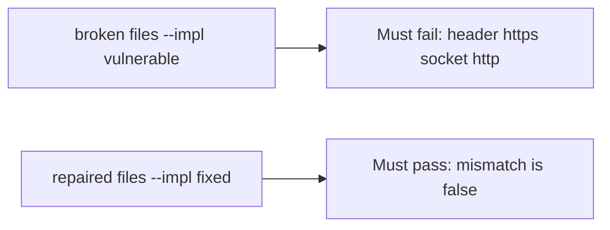

# HTTPS in the header with HTTP on the socket must fail

**Kind:** verification-lab
**Loop step:** 5 Verify

## Check it

“TLS is on” is not evidence. “Force HTTPS is checked” is a tool observation. The check is: `channel_is_https({"X-Forwarded-Proto": "https"}, "http")` is False. That observation must be **false** on the broken files (the helper still returns true) and **true** on the repaired files.

## Picture: header https, socket http must fail

A check that only asserts “HTTPS is on” can still look green while a client header still counts as TLS.



If both pass, the test is not looking at header versus socket. If both fail, the fix is not structural or the check is wrong.

## What the check has to show

| Mode | Must show for this topic |
|---|---|
| Normal | socket https is https; plain http is not (`test_server_https_counts` may pass on both) |
| Wrong input / abuse | client header does not make TLS; broken files must fail |
| Failure | unknown scheme does not count as https |
| Not claimed | Certificate checks; mutual TLS; pinning; encrypted client hello |

The file is `labs/5.4/5.4-lab/tests/test_property.py`. The test `test_client_forwarded_proto_is_not_tls` calls `channel_is_https` with header https and socket http. That check is there so a client header counted as TLS cannot sneak through.

A test that only asserts the site loads on port 443 is not this topic’s evidence. A test that only greps `https` in a dashboard without calling `channel_is_https` on the mismatch is not this topic’s evidence. This practice never opens a live load balancer.

```text
python3 -m pytest labs/5.4/5.4-lab/tests --impl vulnerable
python3 -m pytest labs/5.4/5.4-lab/tests --impl fixed
```

Map the test to the header-https × socket-http row you wrote. Honest socket-https may pass on both implementations. That does not excuse the mismatch test. If the broken files do not fail header-https + socket-http, the lab is miswired — fix the wiring, not the check. A setup error is not proof the rule holds.

## What the tests do not prove

- Certificate checks (a client-side rule)
- OCSP stapling / encrypted client hello (advanced extras)
- Phone network checks (later)
- Bound load-balancer identity in production
- Pinning as a requirement

Record those as leftover or later topics, not as silent passes.

## Practice

Run both this session:

```text
python3 -m pytest labs/5.4/5.4-lab/tests --impl vulnerable
python3 -m pytest labs/5.4/5.4-lab/tests --impl fixed
```

Paste nothing from answer keys. Write fail/pass into your notes next to the matrix row. Reject a “test” that only greps `https` in a dashboard without calling `channel_is_https` on the mismatch.

## Use it somewhere new

Clinic page. A test that only asserts the site loads on port 443 is not this rule (that wait belongs with later availability work). A test that probes a live clinic is out of scope.

## What this page is not doing

Do not add a live TLS attack. Do not log cookie values. Answer keys are not on this site.
