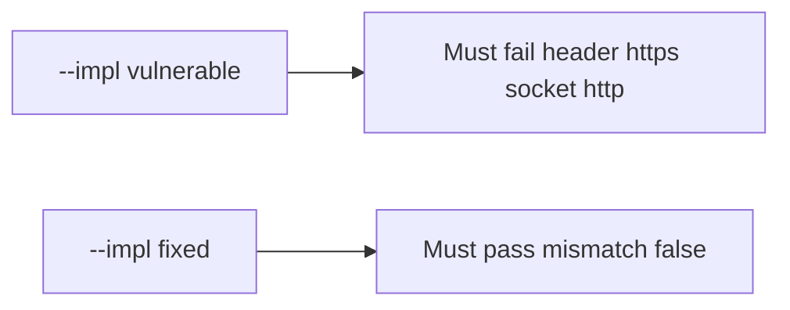

# 5.4-LO-05 — Evidence is header mismatch false, then a passing pair

**Kind:** verification-lab
**Loop step:** 5 Verify
**Standards:** OWASP ASVS 5.0.0 (final) `v5.0.0-12.2.1`.

## An invariant that cannot fail a test is still a slogan

“TLS is on” is not evidence. The oracle is the local pair.

## Mental model: fail-on-vulnerable, pass-on-fixed



| Case | Must show |
|---|---|
| Negative / abuse | client header does not make TLS |
| Normal | socket https is https; plain http is not |
| Not claimed | Cert validation; mTLS; pinning; ECH |

```
python3 -m pytest labs/5.4/5.4-lab/tests --impl vulnerable
python3 -m pytest labs/5.4/5.4-lab/tests --impl fixed
```

Honest socket-https may pass on both.

## What the tests do not prove

- Certificate validation (`v5.0.0-12.3.2`)
- OCSP / ECH Level 3
- MASVS-NETWORK (8.x)

## Practice

Execute both implementations. Map each test to an LO-02 cell.

## Transfer

Clinic SPA. A test that only asserts the site loads on port 443 is not this cell.
