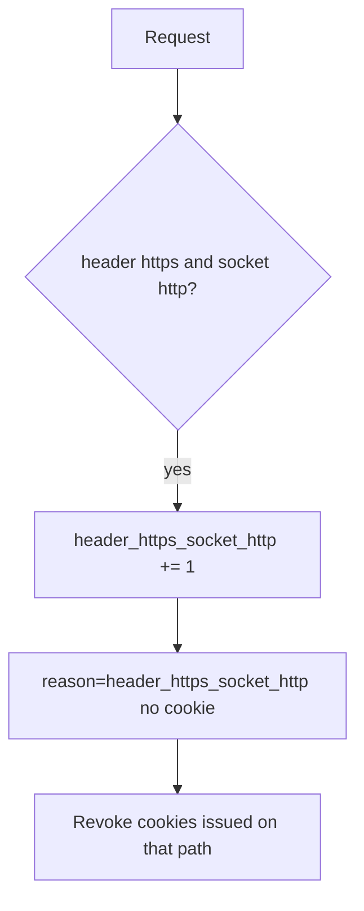

# 5.4-LO-06 — Detect header/socket mismatch; revoke cleartext cookies

**Kind:** operations-exercise
**Loop step:** 6 Operate
**Standards:** NIST CSF 2.0 (final) DE/RS/RC as outcome labels; OWASP ASVS 5.0.0 (final) `v5.0.0-12.2.1`.

## Prevention is not absolute

A misconfigured proxy can start trusting `*` again. Pair detect and recover. Do not log cookie values (4.3).

## Mental model: mismatch is a signal



| Outcome | This module |
|---|---|
| Detect | `header_https_socket_http` |
| Signal | request id, socket scheme; never the cookie |
| Recover | Stop trusting the header; HSTS once TLS is real; revoke cleartext cookies |
| Residual | Pinning trade-off (8.x) |

## Practice

Write one log line you would accept. Tie it to `labs/5.4/5.4-lab`.

```
log_denied reason=header_https_socket_http socket=http request_id=req_54ch
```

Reject any line that includes a session cookie or note body.

## Transfer

Clinic: detect SPA-https vs API-http; do not paste cookies into the ticket.

## Non-goals

SIEM product names are not the property.
