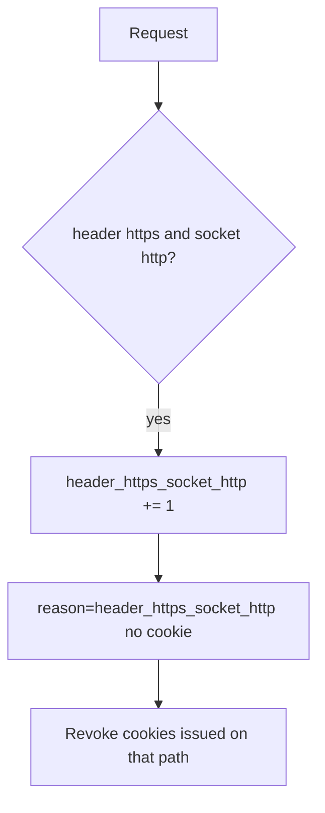

# Notice header/socket mismatch; revoke cleartext cookies

**Kind:** operations-exercise
**Loop step:** 6 Operate

## Fixing it once is not enough

A misconfigured proxy can start trusting `*` again after `channel_is_https` was “fixed once.” Do not log cookie values. Do not paste a session into the ticket.

## Picture: header versus socket mismatch is a signal

When you see a client header saying https while the socket is http, leave cookies off the pager. Then revoke the cleartext cookies.



A log product does not bind the socket. Someone still has to own the mismatch.

## Signals that do not become a second leak

| Outcome | This topic |
|---|---|
| Notice | `header_https_socket_http` |
| What the line holds | request id, socket scheme — **never** the cookie |
| Respond | Stop trusting the header |
| Recover | HSTS once TLS is real; revoke cleartext cookies; re-run `test_client_forwarded_proto_is_not_tls` |
| Leftover | Pinning (later on phones); cookies already copied |

```text
log_denied reason=header_https_socket_http socket=http request_id=req_54ch
```

Not: a session cookie, a note body, or “HSTS handled.”

Putting a session cookie or a note body in the alert leaves a second copy in the pager.

A green “Force HTTPS” tile is not that check. Re-run `test_client_forwarded_proto_is_not_tls` after any proxy change. Page `https://` versus API socket `http` is another path of the same rule — inventory it before claiming recover.

## What the framework does vs what you still have to check

A CDN dashboard will show “HTTPS only” and stay silent when the app still trusts `X-Forwarded-Proto` from anyone. Notice must observe **header https and socket http**, not a preload list. A server flag that trusts proxy headers does not emit this alert for you.

## Can people still use it

If a human sees a certificate or mixed-content warning, make the error readable. Do not encode “not TLS” as color only. A silent fail that pushes people onto http is leftover risk, not polish.

## Practice

Write a log line (ids, reason, no cookie). Reject any line that includes a session cookie, a note body, or “HSTS handled.”

## Use it somewhere new

Notice page-https versus API-http; do not paste cookies into the ticket. Do not probe a live clinic.

## What this page is not doing

Do not use live TLS hunts. This site does not mark you as finished. Answer keys are not on this site.
