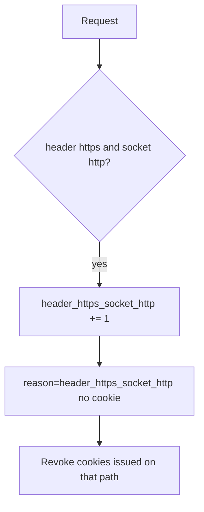

# Notice header/socket mismatch; revoke cleartext cookies

**Kind:** operations-exercise
**Loop step:** 6 Operate

## Stopping it is not enough

A misconfigured proxy can start trusting `*` again after `channel_is_https` was “fixed once.” Pair notice and recover. Do not log cookie values. Do not paste a session into the ticket.

## Picture: header versus socket mismatch is a signal

A client header saying https while the socket is http is a notice-and-recover problem, not a licence to quote cookies in the paging channel. Notice names the event. Recover revokes the cleartext cookies. Neither reprints the cookie.



Industry lists talk about noticing, responding, and recovering. They do not bind the socket. They do not pick a log product. Someone still has to own the mismatch.

## Signals that do not become a second leak

| Outcome | This topic |
|---|---|
| Notice | `header_https_socket_http` |
| What the line holds | request id, socket scheme — **never** the cookie |
| Respond | Stop trusting the header |
| Recover | HSTS once TLS is real; revoke cleartext cookies; re-run `test_client_forwarded_proto_is_not_tls` |
| Leftover | Pinning (later on phones); cookies already copied |

A log line a reviewer can accept looks like:

```text
log_denied reason=header_https_socket_http socket=http request_id=req_54ch
```

Not: a session cookie, a note body, or “HSTS handled.”

If your alert includes a session cookie or a note body, you have opened a second leak in the paging channel.

A green “Force HTTPS” tile is not that check. Re-run `test_client_forwarded_proto_is_not_tls` after any proxy change. Page `https://` versus API socket `http` is another path of the same rule — inventory it before claiming recover.

## What the framework does vs what you still have to check

A CDN dashboard will show “HTTPS only” and stay silent when the app still trusts `X-Forwarded-Proto` from anyone. Notice must observe **header https and socket http**, not a preload list. A server flag that trusts proxy headers does not emit this alert for you.

## Can people still use it

If a human sees a certificate or mixed-content warning, make the error readable. Do not encode “not TLS” as color only. A silent fail that pushes people onto http is leftover risk, not polish.

## Practice

Write one log line you would accept in review (ids, reason, no cookie). Tie it to `labs/5.4/5.4-lab`. Reject any line that includes a session cookie, a note body, or “HSTS handled.”

## Use it somewhere new

A clinic example: notice page-https versus API-http; do not paste cookies into the ticket. Do not probe a live clinic.

## What this page is not doing

Naming a product is not the rule. Live TLS hunts are out of scope. This site does not mark you as finished. Answer keys are not on this site.
