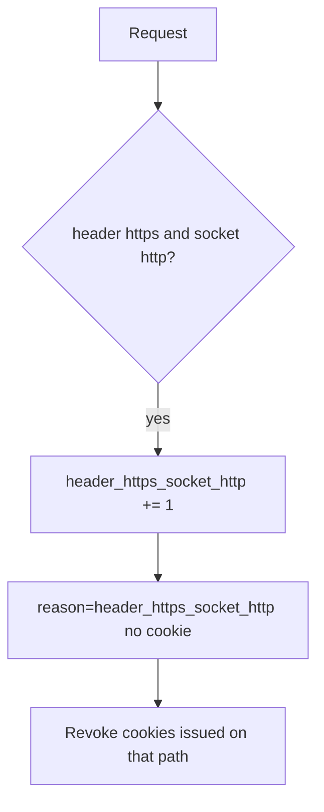

# 5.4-LO-06 — Detect header/socket mismatch; revoke cleartext cookies

**Kind:** operations-exercise
**Loop step:** 6 Operate
**Standards:** NIST CSF 2.0 (final) DE/RS/RC as outcome labels; OWASP ASVS 5.0.0 (final) `v5.0.0-12.2.1`. CSF names outcomes; it does not bind the socket.

## Prevention is not absolute

A misconfigured proxy can start trusting `*` again after `channel_is_https` was “fixed once.” Pair detect and recover. Do not log cookie values (4.3). Do not paste a session into the ticket.

## Mental model: header versus socket mismatch is a signal



| Outcome | This module |
|---|---|
| Detect | `header_https_socket_http` |
| Signal | request id, socket scheme; never the cookie |
| Recover | Stop trusting the header; HSTS once TLS is real; revoke cleartext cookies |
| Residual | Pinning trade-off (8.x); cookies already copied |

CSF 2.0 Detect / Respond / Recover name outcomes. They do not prove `v5.0.0-12.2.1`. A SIEM product name is not the property. Re-run `test_client_forwarded_proto_is_not_tls` after any proxy change; a green “Force HTTPS” tile is not that pytest. SPA baseURL vs API socket is another path of the same cell — inventory it before claiming Recover.

## Framework defaults versus the operate guarantee

A CDN dashboard will show “HTTPS only” and stay silent when uvicorn still trusts `X-Forwarded-Proto` from anyone. Detection must observe **header https ∧ socket http**, not a preload list. If the alert includes a session cookie or note body, you have opened a 4.3 / 3.1 cell.

## Practice

Write one log line you would accept. Tie it to `labs/5.4/5.4-lab`.

```text
log_denied reason=header_https_socket_http socket=http request_id=req_54ch
```

Reject any line that includes a session cookie, a note body, or “HSTS handled.”

## Transfer

Clinic: detect SPA-https vs API-http; do not paste cookies into the ticket. Do not probe a live clinic.

## Usability

If a human sees a certificate or mixed-content warning, make the error readable (WCAG 2.2). A silent fail that pushes people onto http is a security residual, not polish.

## Non-goals

SIEM product names are not the property. Live TLS hunts are out of scope. Gates 0–10 stay not-attempted.
