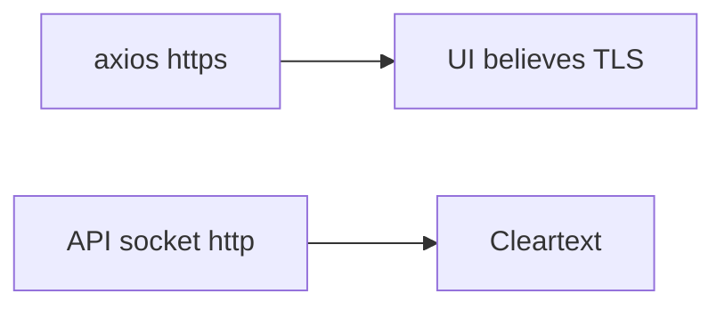

# Same idea: an https page talking to an http API

**Kind:** transfer-challenge
**Loop step:** 7 Transfer

## Use it somewhere new

The notes-app scaffolding goes away. You get a **clinic page** whose API client uses `https://` while the API socket is `http`. A dashboard that “forces HTTPS” sits next to that socket. Your job is to rewrite the loop, not to name a bug-list code.

The notes-app sentence was: `channel_is_https({"X-Forwarded-Proto": "https"}, "http")` is false. Rewrite it for a clinic without changing the fork: a client header is not TLS.

## Picture: the URL bar is not the socket

Renaming “notes app” to “clinic” is not transfer. The leftover changes. An https page does not authorize treating the API socket as TLS. A dashboard toggle is not the pytest.

| Notes app this week | Clinic sketch |
|---|---|
| `X-Forwarded-Proto: https` | Page API client `https://` |
| `server_scheme http` | API socket `http` |
| `channel_is_https` true on mismatch | Cookies and HSTS as if TLS |
| Cleartext client setting the header | Same, plus a “Force HTTPS” tile |
| Mutual TLS leftover | Service identity — **not** this header; **not** a live clinic |

If the page URL is https and the API socket is http, the rule is gone. A server flag that trusts proxy headers from `*`, a “Force HTTPS” dashboard, and HSTS preload do not bind the socket. Mutual TLS names a **peer**, which is a different rule: it still must not treat a client header as that peer.

The clinic rewrite still has to keep the notes-app fork: header https + socket http is false. Enabling a CDN “HTTPS only” tile while the app trusts `X-Forwarded-Proto` from anyone leaves the confused deputy. The local pytest analogue is `test_client_forwarded_proto_is_not_tls` — on a practice, not a live clinic.

## Prompt — clinic page vs API socket

Rewrite the notes-app sentence. Include:

1. who can act (cleartext client setting Forwarded-Proto — **not** a live clinic);
2. what you trust (which socket or bound load balancer is trusted; the dashboard toggle is not);
3. what must not happen (`channel_is_https` true on header/socket mismatch, not a legal label);
4. a test idea on **local** files only (header https + socket http is false — never on the real clinic);
5. leftover (TLS to the load balancer; pinning versus breakage; OCSP / encrypted client hello as advanced extras);
6. whether a human-read certificate warning must not use color as the only cue, and must not silently push people onto http.

## What is not good enough

| Reject | Why |
|---|---|
| “Force HTTPS is on” | Dashboard theater |
| Live clinic probe | Course rules |
| Pinning as the rule | Leftover, and not this practice |
| HTTP 200 on port 443 as this rule | Wrong observation |
| Client URL bar as TLS | Wrong hop |

## Practice

One page. No answer keys. The only running system you may break is `labs/5.4/5.4-lab`. Do not probe a live host or paste cookies into a ticket.

## What this page is not doing

Live-target TLS attacks. Real session cookies. Claiming a course gate from this page.
