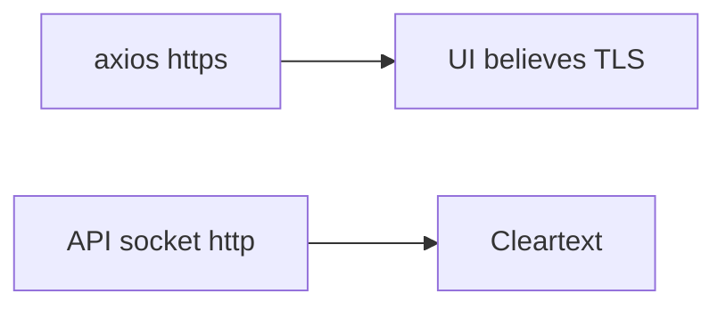

# 5.4-LO-07 — Transfer: SPA https URL vs http API socket

**Kind:** transfer-challenge
**Loop step:** 7 Transfer
**Standards:** RFC 9846 (final); OWASP ASVS 5.0.0 (final) `v5.0.0-12.2.1`. Pinning is a trade-off.

## Change the workplace; keep socket-not-header

Do not answer with a Top 10 / CWE / scanner as the definition of security.

**Prompt:** Clinic SPA axios `https://` baseURL while the API socket is `http`. Also name mTLS service identity vs this header.

**Product sketch:** EHR-lite behind a dashboard that “forces HTTPS.”

Rewrite the SecureCollab sentence. Include:

1. attacker capabilities (cleartext client setting Forwarded-Proto — not a live clinic);
2. trust assumptions (which socket/bound LB is TCB; the dashboard toggle is not);
3. forbidden outcome (`channel_is_https` true on header/socket mismatch, not “HIPAA”);
4. a test idea on a **local** fixture only;
5. residual (TLS-to-LB; pinning vs breakage; OCSP/ECH Level 3);
6. WCAG if a human certificate-warning path is in the claim (readable error, not a silent fail that pushes people onto http).

## Mental model: the URL bar is not the socket

## What graders reject

| Reject | Why |
|---|---|
| “Force HTTPS is on” | Dashboard theater |
| Live clinic probe | Lab policy |
| Pinning as the property | Trade-off, and not this lab |

## Practice

One page. No keys. `labs/5.4/5.4-lab` is the only running system you may break.
