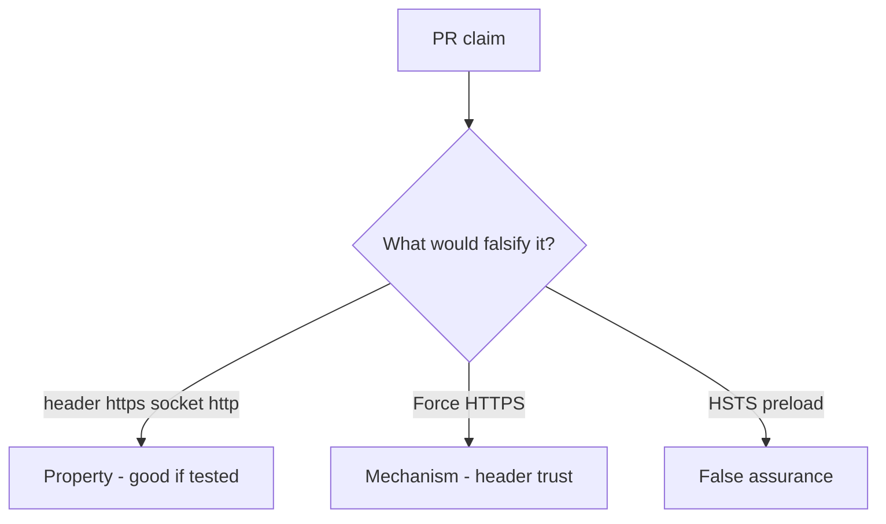

# 5.4-LO-08 — Review trusted Forwarded-Proto as a PR, not a TLS ticket

**Kind:** code-review
**Loop step:** Review
**Standards:** OWASP ASVS 5.0.0 (final) `v5.0.0-12.2.1`.

## Review the fixture as if it were SecureCollab channel binding

Review `labs/5.4/5.4-lab/vulnerable/` as a SecureCollab PR. Your job is not to count suspicious lines. Reconstruct whether `channel_is_https({"X-Forwarded-Proto": "https"}, "http")` is still true, compare that with the module invariant, and write changes a developer can verify.

Intended findings live only in `content/assessment/keys/5.4.md` — not here. Do not open the keys file until your review has been evaluated.

## Mental model: channel_is_https trusts X-Forwarded-Proto from anyone

Start with this seeded smell: **`channel_is_https` trusts `X-Forwarded-Proto` from anyone**. Label it property, mechanism, or false assurance before you accept the PR.

Classification starts at the protected effect (mismatch false). Everything that is not `server_scheme == "https"` at that call is a candidate confused-deputy path. `--proxy-headers` with `*` is the same smell, not a different finding class.

## Seeded smells (label them yourself)

- `channel_is_https` trusts `X-Forwarded-Proto` from anyone
- `--proxy-headers` with `*`
- No test header vs socket mismatch
- HSTS on an app that still accepts http

Also reject: live TLS attacks; closing findings without re-running `test_client_forwarded_proto_is_not_tls`; keys in lessons; client URL bar as the socket.

## Misconceptions this module refuses

- HTTPS URL in the client proves TLS
- Forwarded headers are for security
- Pinning is always required
- HSTS preload is the property
- A CDN “HTTPS only” tile binds the socket

## Practice

Write three review notes a maintainer could act on. Each note: observation, property or false assurance, suggested structural change, residual you will **not** delete. Tie at least one to `test_client_forwarded_proto_is_not_tls`.

## Transfer

Clinic PR that “enabled HTTPS” by trusting Forwarded-Proto is an incomplete mediation review. Name the independent falsehood that would still keep the header from counting as TLS.

## Non-goals

Do not merge by adding a comment “will bind the proxy later.” That comment is a residual without an owner. Do not probe a live host to prove the finding.
