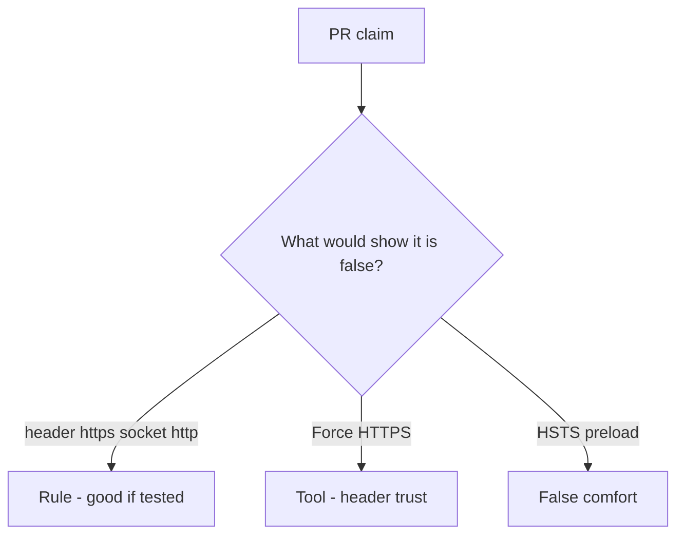

# Review of trusted Forwarded-Proto

**Kind:** code-review
**Loop step:** Review

Intended findings live only in the answer-key folder — not here. Do not open that file until your review has been evaluated.

## What you are reviewing

A colleague ships notes-app channel binding. Review `labs/5.4/5.4-lab/vulnerable/` as that change. Your job is not to count suspicious lines. Reconstruct whether `channel_is_https({"X-Forwarded-Proto": "https"}, "http")` is still true, compare that with the rule, and write changes a developer can verify.

The check you already ran (`test_client_forwarded_proto_is_not_tls`) is the rule test. A comment “will bind the proxy later” is not.

## Picture: problems to find (name them yourself)

Start with this seeded smell: **`channel_is_https` trusts `X-Forwarded-Proto` from anyone**. Label it rule, tool, or false comfort before you accept the change.

The review starts at the protected effect (mismatch false). Everything that is not `server_scheme == "https"` at that call is a candidate extra path. A server flag that trusts proxy headers from `*` is the same smell, not a different finding class.

## Seeded smells (label them yourself)

- `channel_is_https` trusts `X-Forwarded-Proto` from anyone
- A server flag that trusts proxy headers from `*`
- No test of header versus socket mismatch
- HSTS on an app that still accepts http

Also reject: live TLS attacks; closing findings without re-running `test_client_forwarded_proto_is_not_tls`; keys in learner notes; treating the client URL bar as the socket.

## Common mix-ups

- An HTTPS URL in the client proves TLS
- Forwarded headers are for security
- Pinning is always required
- HSTS preload is the rule
- A CDN “HTTPS only” tile binds the socket

## Practice

Write three review notes a maintainer could act on. Each note: what you saw, rule or false comfort, suggested structural change, leftover you will **not** delete. Tie at least one note to `test_client_forwarded_proto_is_not_tls`. Do not open the keys file.

## Use it somewhere new

Clinic change that “enabled HTTPS” by trusting Forwarded-Proto is an incomplete review of channel binding. Name the independent falsehood that would still keep the header from counting as TLS.

## Can people still use it

If the dashboard shows an HTTPS badge, do not encode it as color only. That is a cue for operators, not the socket check.

## What this page is not doing

Do not merge by adding a comment “will bind the proxy later.” That comment is leftover without an owner. Do not probe a live host to prove the finding.
