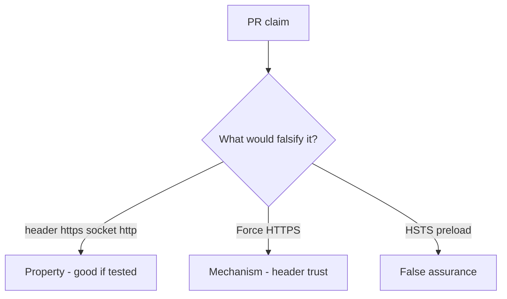

# 5.4-LO-08 — Review trusted Forwarded-Proto as a PR, not a TLS ticket

**Kind:** code-review
**Loop step:** Review
**Standards:** OWASP ASVS 5.0.0 (final) `v5.0.0-12.2.1`.

## Review the fixture as if it were SecureCollab channel binding

Review `labs/5.4/5.4-lab/vulnerable/` as a SecureCollab PR. Intended findings live only in `content/assessment/keys/5.4.md` — not here.

## Mental model: property, mechanism, or false assurance

Seeded smells (label them yourself; do not open the keys file):

- `channel_is_https` trusts `X-Forwarded-Proto` from anyone
- `--proxy-headers` with `*`
- No test header vs socket mismatch
- HSTS on an app that still accepts http

Also reject: live TLS attacks, keys in lessons.

## Misconceptions

- HTTPS URL in the client proves TLS
- Forwarded headers are for security
- Pinning is always required

## Practice

Write three review notes. Tie at least one to `test_client_forwarded_proto_is_not_tls`.

## Transfer

Clinic PR that “enabled HTTPS” by trusting Forwarded-Proto is incomplete.
