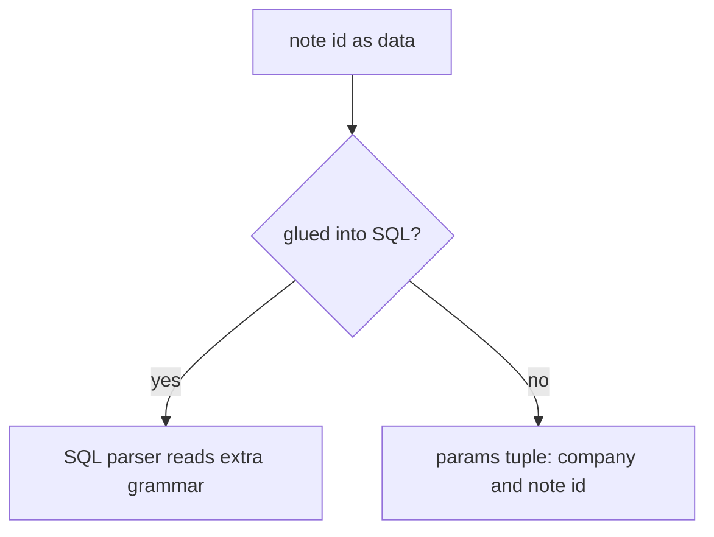
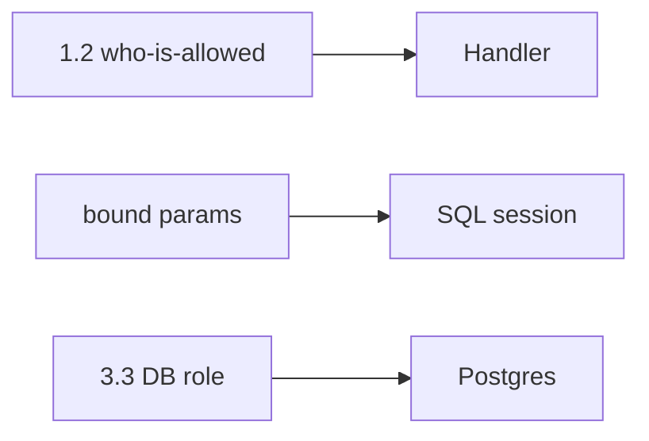

# Note id is data, not SQL grammar

**Kind:** concept-model
**Loop step:** 1 Property

## The rule

The notes app must fetch a note by **company and note id as data**. The SQL engine must not read those fields as extra grammar. Module 1.2 already taught who-is-allowed. This week's check is **keeping data out of the SQL program**. Module 3.3's database role is a second check, not a substitute for parameters.

> `fetch_sql` must return a bound pair (`sql`, `params`), not a glued string. Who-is-allowed from 1.2 is still required. It is not the same as isolating the interpreter.

What must not happen is **a query built by concatenating untrusted strings into SQL**. That is a secrecy and integrity failure of rows: the parser can read other companies or change rows even when the handler meant “one note.”

Use parameterized queries — SQL, and later the same shape for other query languages. They still want cross-company controls. A least-privilege account to the database. Logging every who-is-allowed decision, and never the sensitive data, is **advanced** work, not this week's check. A later row-level rule in PostgreSQL is a platform extra, not this sentence. SQLAlchemy `text()` with an f-string is still concatenation.

## Picture: data vs SQL grammar



Who could do this: a member who types a note id that the SQL parser would treat as grammar, or anyone who steals the `app` role (3.3). What you trust in this practice: the bound API. A live database is not in scope.

**The tool (not the rule):** an ORM name, a web filter rule, or a denylist of quotes.

## Picture: three checks, not one sticker



Parameters without 1.2 still leak through honest queries. Who-is-allowed without parameters still lets the parser rewrite the query. The `app` role without either still fails if someone concatenates.

## Why it happens, what it costs, how you stop it, how you notice, how you recover

| Slice | For this rule |
|---|---|
| Why it happens | Data and program mixed in one string |
| What has to be true first | `fetch_sql` returns a concatenated `str` |
| Trigger | Hostile `note_id` (this practice treats it as data only) |
| What it costs | Secrecy and integrity of rows |
| How you stop it | Bind tenant and note id as parameters; allow-list names for ORDER BY |
| How you notice | `sql_error_spike`; `grant_drift` (3.3) |
| How you recover | Rotate database passwords; restore if rows were changed |

## What the framework does vs what you still have to check

SQLAlchemy `text()` with an f-string is still concat. An ORM `.filter` that interpolates a raw string is still concat. A row-level rule left off “for tests” is not a who-is-allowed table. The app's promise: `fetch_sql` is not a concatenated string. The folder is `labs/5.5/5.5-lab`. Fake data only. No live database.

## What the tool cannot do

- Bound ids plus missing 1.2 still leak through honest SELECTs.
- Identifier injection in ORDER BY, table names, `COPY`, and search languages — named leftover, not this practice.
- Replicas and backups still hold copies (5.1).

## Practice

Draw data vs grammar for `fetch_sql`. Then run:

```text
python3 -m pytest labs/5.5/5.5-lab/tests --impl vulnerable
python3 -m pytest labs/5.5/5.5-lab/tests --impl fixed
```

The first command must fail. The second must pass.

## Use it somewhere new

Clinic search box. NoSQL operators and GraphQL args wait for 7.1.

## What this page is not doing

Live SQL attacks, weaponized cookbooks, dumping lab Python into notes. This site does not mark you as finished. Answer keys are not on this site.
