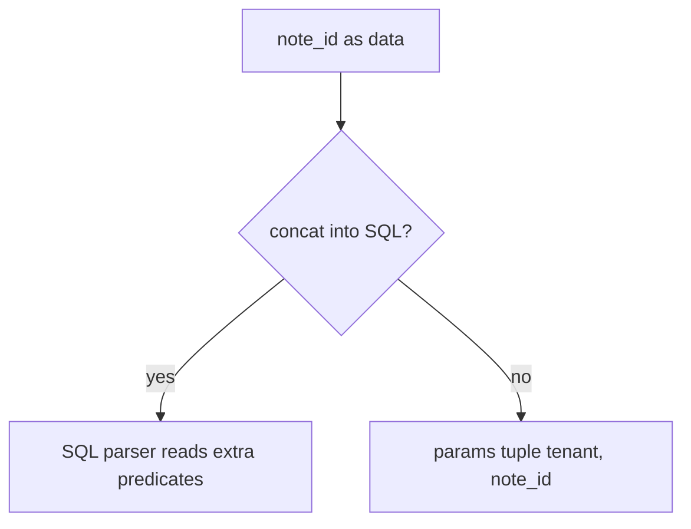
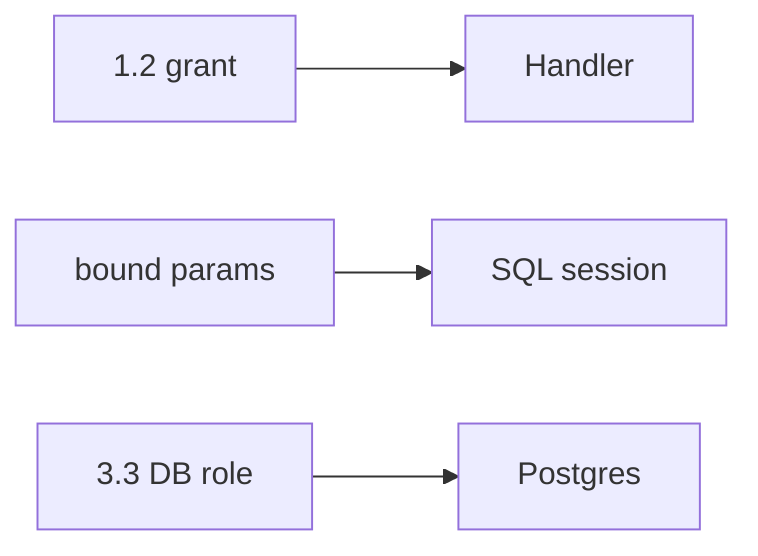

# 5.5-LO-01 — Note id is data, not SQL grammar

**Kind:** concept-model
**Loop step:** 1 Property
**Standards:** OWASP ASVS 5.0.0 (final) `v5.0.0-1.2.4`, `v5.0.0-8.4.1`, `v5.0.0-13.2.2`; `v5.0.0-16.3.2` Level 3 clause is **advanced**. PostgreSQL RLS docs are *platform*, not this sentence. SQLAlchemy `text()` with an f-string is still concatenation.

## The claim this module owns

SecureCollab Phase 1 must fetch a note by **tenant and note id as data**. The SQL interpreter must not parse those fields as extra predicates. Module 1.2 already taught the grant cell; this module’s cell is **complete mediation of the SQL grammar**. Module 3.3’s database role is a second gate, not a substitute for parameters.

> `fetch_sql` must return a bound structure (`sql`, `params`), not a concatenated string. Application 1.2 is necessary; it is not interpreter isolation.

The forbidden outcome is **a query built by concatenating untrusted strings into SQL**. That is a 1.1 confidentiality and integrity failure of rows: the parser can read other tenants or mutate rows even when the handler meant “one note.”

ASVS `v5.0.0-1.2.4` wants parameterized queries (SQL, HQL, NoSQL, Cypher — same shape). `v5.0.0-8.4.1` still wants cross-tenant controls. `v5.0.0-13.2.2` wants least-privilege service accounts to the data layer. `v5.0.0-16.3.2`’s Level 3 clause (log every authorization decision, never the sensitive data) is **advanced**.

## Mental model: data vs SQL grammar



The attacker is a member who types a note id that the SQL parser would treat as grammar, or anyone who steals the `app` role (3.3). Trust is the bound API in this lab. A live database is not in scope.

**Mechanism (not the property):** an ORM name, a WAF rule, or a denylist of quotes.

## Mental model: three gates, not one sticker



Parameters without 1.2 still leak via legitimate queries. 1.2 without parameters still lets the parser rewrite the query. The `app` role without either still fails if someone concatenates.

## Root cause vs impact vs prevention vs detection vs recovery

| Slice | For this property |
|---|---|
| Root cause | Data and program mixed in one string |
| Preconditions | `fetch_sql` returns a concatenated `str` |
| Trigger | Hostile `note_id` (lab treats it as data only) |
| Impact | Confidentiality/integrity of rows |
| Prevention | Bind tenant and id; allow-list identifiers for ORDER BY |
| Detection | `sql_error_spike`; `grant_drift` (3.3) |
| Recovery | Rotate DB creds; restore if mutated |

## Framework defaults versus the query guarantee

SQLAlchemy `text()` with an f-string is still concat. An ORM `.filter` that interpolates a raw string is still concat. RLS left disabled “for tests” is not a grant table.

## Mechanism limits

- Bound ids plus missing 1.2 still leak via legitimate SELECTs.
- Identifier injection in ORDER BY, table names, `COPY`, and search DSLs — named residual, not this fixture.
- Replicas and backups still hold copies (5.1).

## Practice

Draw data vs grammar for `fetch_sql`. Then run:

```
python3 -m pytest labs/5.5/5.5-lab/tests --impl vulnerable
python3 -m pytest labs/5.5/5.5-lab/tests --impl fixed
```

The first command must fail. The second must pass.

## Transfer

Clinic search box. NoSQL operators and GraphQL args wait for 7.1.

## Non-goals

Live SQL attacks, weaponized cookbooks, dumping lab Python into notes. Gates 0–10 and milestones M0–M5 stay **not-attempted**. Answer keys are not in this file.
