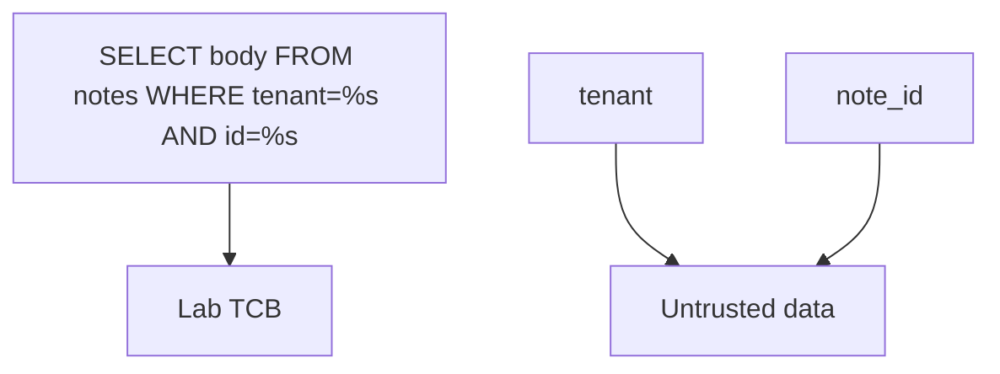
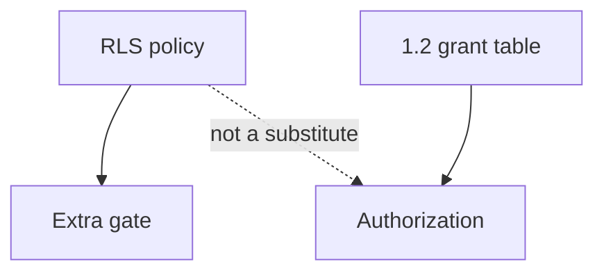

# 5.5-LO-02 — A three-gate map a second engineer can test

**Kind:** design-exercise
**Loop step:** 2 Model
**Standards:** OWASP ASVS 5.0.0 (final) `v5.0.0-1.2.4`, `v5.0.0-8.4.1`.

## Can a second engineer name pytest cases from your query map?

“We use an ORM” is not this lesson. A reviewable model names **what is SQL text, what is a bound parameter, and which role runs it**.

SecureCollab Phase 1 freeze: local `fetch_sql(tenant, note_id)` / `is_bound`. No live PostgreSQL.

## Mental model: SQL text is TCB; values are not

The parser must receive a fixed program. Tenant and id travel beside it.

## Mental model: RLS is not the grant table

PostgreSQL RLS is platform. Module 3.3 already refused RLS as a replacement for 1.2. This module refuses it as a replacement for parameters.

## Step 1: freeze pieces

| Piece | This system |
|---|---|
| Subjects | member; stolen `app` role |
| Objects | note row; SQL text vs params |
| Actions | `fetch_sql`, `is_bound` |
| Channels | SQL session |
| TCB | Bound API (`psycopg`-style parameters) |
| Untrusted | `note_id`, sort columns, search `q` |
| State / time | One request; migrations and replicas residual |
| 1.1 cell | Confidentiality/integrity of rows |

## Step 2: write cells

| Subject | Object | Action | Decision |
|---|---|---|---|
| app | tenant + id | query as params | bound |
| attacker | id field | as SQL grammar | deny |
| migrator | DDL | run | offline role |
| analyst | bodies | SELECT | 3.3 cell |

## Practice

Draw the three gates. Point at `labs/5.5/5.5-lab` file `query.py`.

## Transfer

Clinic search box as a second interpreter (query DSL).

## Residual risk

DB superuser tools; replicas; ORDER BY identifiers.

## Non-goals

Top 10 as the definition of security. Keys stay out of lessons.
