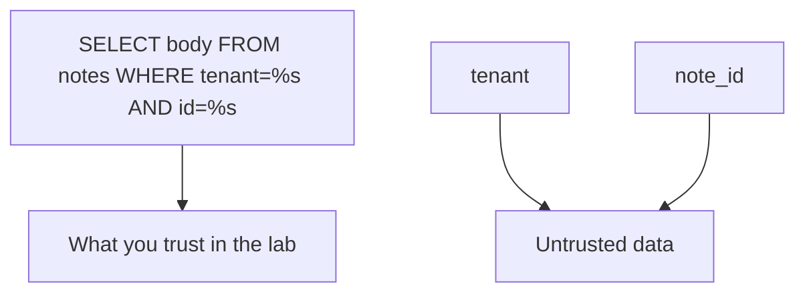
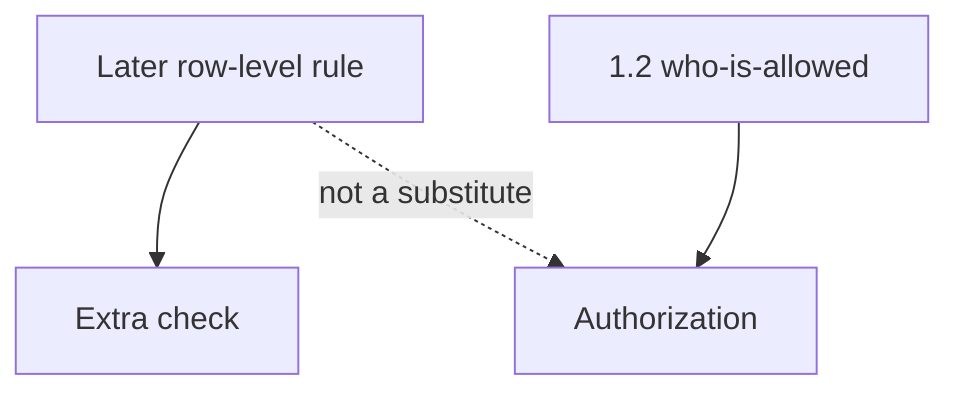

# A three-check map someone else can test

**Kind:** design-exercise
**Loop step:** 2 Model

## Could someone else name the checks?

“We use an ORM” is not this lesson. A map someone else can test names **what is SQL text**, **what is a bound parameter**, and **which role runs it**.

`fetch_sql(tenant, note_id)` and `is_bound` is local. No live PostgreSQL.

> Bind tenant and note id as parameters. The parser must receive a fixed program. Company and id travel beside it.

## Picture: SQL text is trusted; values are not

The parser must receive a fixed program. Tenant and id travel beside it, not inside it.

## Picture: a row-level rule is not the who-is-allowed table

A later row-level rule in PostgreSQL is platform. Module 3.3 already refused it as a replacement for 1.2. This module refuses it as a replacement for parameters.

## Step 1: name the pieces

| Piece | This system |
|---|---|
| Who | member; stolen `app` role |
| What | note row; SQL text vs params |
| Actions | `fetch_sql`, `is_bound` |
| Paths | SQL session |
| What you trust | Bound API (`psycopg`-style parameters) |
| What you do not trust | `note_id`, sort columns, search `q` |
| Time | One request; migrations and replicas leftover |
| The rule | Secrecy and integrity of rows |

## Step 2: write allow and deny

| Who | What | Action | Decision |
|---|---|---|---|
| app | company + id | query as params | bound |
| attacker | id field | as SQL grammar | deny |
| migrator | DDL | run | offline role |
| analyst | bodies | SELECT | 3.3 cell |

A missing “hostile note id × SQL grammar × deny” row is how concatenated SQL appears. Write the hole.

## Practice

In `labs/5.5/5.5-lab`, mark `query.py`. Fake data only.

## Use it somewhere new

Clinic search box as a second interpreter (query language).

## What can still go wrong

Database superuser tools; replicas; ORDER BY identifiers.

## What this page is not doing

Do not run this map against a live clinic or a live database. Answer keys are not on this site.
