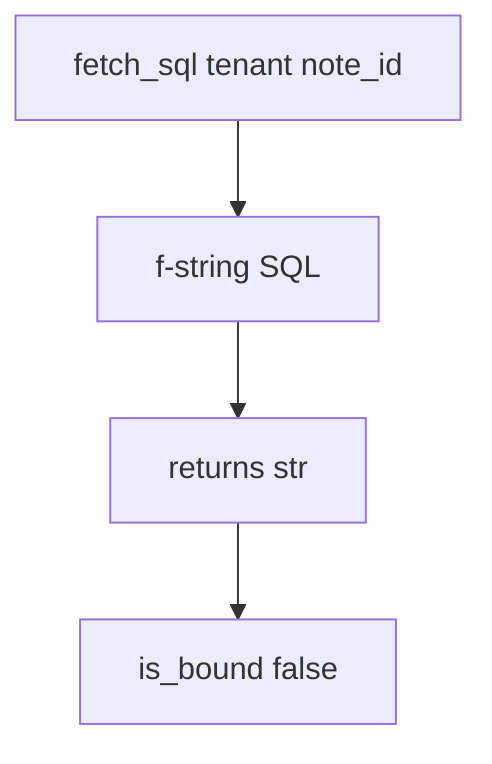

# Practice: a query built by gluing untrusted strings

**Kind:** mechanism-lab
**Loop step:** 3 Break

## Try it

The practice is not a website you attack. It is a tiny Python `fetch_sql` and `is_bound`. It does not open PostgreSQL. The failure is already in the function: it glues company and note id into the SQL text. Watch the check treat that as a **failed rule**, not as a trophy dump of another company.

The rule under test:

> Tenant and note id are bound parameters, not SQL grammar. `fetch_sql` must return a bound pair, not a concatenated string.

## Where you may practice

Only `labs/5.5/5.5-lab` is in scope. The maps are in-process: `fetch_sql` / `is_bound`. Fake company `tA` and note ids. It does not open PostgreSQL.

Do not probe a live database. Do not probe an employer replica. Do not probe a classmate preview. Do not paste a live query “to see what happens.”

What must not happen: a query built by concatenating untrusted strings into SQL. `fetch_sql` returns a `str` instead of a bound `(sql, params)` pair.

Who could do this: a member who can supply `note_id` (or company) text that the SQL parser would treat as extra grammar. That stands in for a clinic search box, an ORDER BY column name, or a GraphQL argument later in 7.1. What is supposed to stop this: `fetch_sql` binds those fields as **data**. SQLAlchemy `text()` with an f-string, a quote denylist, and “row-level security is on in production” are not enough.

## Picture: one string is two languages



The broken files show **cause** (data mixed into SQL grammar), not a trophy dump of another company. What has to be true first: `fetch_sql` interpolates `tenant` and `note_id` into the SQL text; `is_bound` looking for `%s` *inside that concatenated string* is a false check. You do not need a live `psql`. You must not run one.

Industry lists ask for parameterized queries. A scanner name for this family is a weakness label, not that check. The test uses a **class** of hostile note-id text — punctuation the parser would treat as extra grammar. Treat it as data for the params tuple. Do not paste it into notes as a cookbook.

## What to look at — cause, not a dump

Read `vulnerable/query.py`. It interpolates `tenant` and `note_id` into the SQL text. Tests:

- `test_query_is_bound_not_concatenated`
- `test_honest_note_id_is_still_bound`

You do not need a new payload. The failure of `test_query_is_bound_not_concatenated` *is* the evidence.

Do not open the repaired files yet. Diagnose the cause first.

| What you see | What kind of failure | Not the lesson |
|---|---|---|
| `fetch_sql` returns a `str` | Concatenated SQL | A scanner name |
| `%s` searched inside that string | False bound check | “The ORM will handle it” |
| Hostile punctuation still glued in | Data treated as grammar | A live dump of another company |

## Why it happens, what it costs, how you stop it, how you notice, how you recover

| Slice | This practice |
|---|---|
| The rule | Tenant and note id are bound parameters, not SQL grammar |
| Why it happens | Data and program mixed in one string |
| What has to be true first | `fetch_sql` returns a concatenated `str` |
| Trigger | `fetch_sql` with a hostile `note_id` (class of extra grammar, not a cookbook) |
| What it costs | Secrecy and integrity of other companies’ rows |
| How you stop it | Bound API `(sql, params)`; fail closed if you cannot bind |
| How you notice | `sql_error_spike` by statement name; never the body |
| How you recover | Stop the concatenating path; rotate database passwords; restore if rows were changed |
| Not the lesson | A scanner name, a famous-bugs mnemonic, or a live dump |

## What the framework does vs what you still have to check

SQLAlchemy `text()` with an f-string is still concatenation. A later row-level rule in Postgres does not parse parameters for you. FastAPI will pass whatever string you interpolate. What this practice is supposed to show: `fetch_sql` is not a `str`.

## Practice

From the repository root, in a throwaway environment:

```text
python3 -m pytest labs/5.5/5.5-lab/tests --impl vulnerable
```

Record `test_query_is_bound_not_concatenated`. Do not probe public hosts. A setup error is not proof the rule holds.

## Use it somewhere new

Clinic search box. Predict without leaving this directory. Do not hit a live clinic system.

## What this page is not doing

No live-target instructions. Fake companies only. No weaponized payloads. Do not “fix” the practice by deleting the test.
