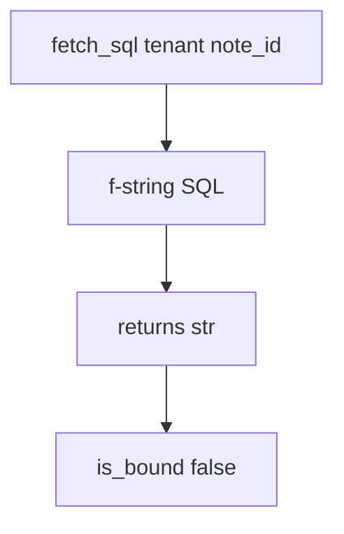

# 5.5-LO-03 — Observe concatenation, do not trophy a database

**Kind:** mechanism-lab
**Loop step:** 3 Break
**Standards:** OWASP ASVS 5.0.0 (final) `v5.0.0-1.2.4`.

## Authorized scope

`labs/5.5/5.5-lab` only. Synthetic tenants `tA` / note ids. No live databases.

**Forbidden outcome:** Query built by concatenating untrusted strings into SQL.

## Mental model: one string is two languages



The vulnerable tree demonstrates **cause** (data mixed into SQL grammar), not a trophy dump of another tenant.

## What to read in the fixture

`vulnerable/query.py` interpolates `tenant` and `note_id` into the SQL text. `is_bound` looking for `%s` inside that string is a false check: placeholders that never received a params tuple are still concatenation if you built the values into the text.

Tests require a non-string bound structure. The quoted test fragment is **data** that must not become grammar. Do not paste it into notes as a cookbook.

## Root cause vs impact

| Slice | Lab |
|---|---|
| Root cause | Data and program mixed in one string |
| Impact | Interpreter can read other tenants / mutate rows |
| Not the lesson | A scanner name or Top 10 mnemonic as the definition |

## Practice

```
python3 -m pytest labs/5.5/5.5-lab/tests --impl vulnerable
```

Record `test_query_is_bound_not_concatenated`. Do not probe public hosts.

## Transfer

Clinic search box. Predict without leaving this directory.

## Non-goals

No live-target instructions. Synthetic data only.
