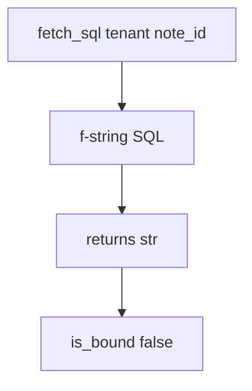

# 5.5-LO-03 — Observe concatenation, do not trophy a database

**Kind:** mechanism-lab
**Loop step:** 3 Break
**Standards:** OWASP ASVS 5.0.0 (final) `v5.0.0-1.2.4`. `v5.0.0-16.3.2` Level 3 logging clause is **advanced**, not this pytest.

## Authorized scope

`labs/5.5/5.5-lab` only. The fixture is an in-process `fetch_sql` / `is_bound`. Synthetic tenant `tA` and note ids. It does not open PostgreSQL. Do not probe a live database, an employer replica, or a classmate preview as this exercise.

**Forbidden outcome:** query built by concatenating untrusted strings into SQL. `fetch_sql` returns a `str` instead of a bound `(sql, params)` structure.

Attacker capability in this lab: a member who can supply `note_id` (or tenant) text that the SQL parser would treat as grammar. That stands in for a clinic search box, an ORDER BY column name, or a GraphQL argument later in 7.1. Trust assumption: `fetch_sql` is supposed to bind those fields as **data**. SQLAlchemy `text()` with an f-string, a quote denylist, and “RLS is on in prod” are not in the TCB for this cell.

## Mental model: one string is two languages



The vulnerable tree demonstrates **cause** (data mixed into SQL grammar), not a trophy dump of another tenant. Preconditions: `fetch_sql` interpolates `tenant` and `note_id` into the SQL text; `is_bound` looking for `%s` *inside that concatenated string* is a false check. You do not need a live `psql`. You must not run one.

ASVS `v5.0.0-1.2.4` wants parameterized queries. A scanner “SQLi” name is a weakness label, not that cell. The quoted test fragment in `test_query_is_bound_not_concatenated` is **data** that must not become grammar — do not paste it into notes as a cookbook.

## What to read in the fixture

`vulnerable/query.py` interpolates `tenant` and `note_id` into the SQL text. Tests:

- `test_query_is_bound_not_concatenated`
- `test_honest_note_id_is_still_bound`

You do not need a new payload. The failure of `test_query_is_bound_not_concatenated` *is* the evidence.

Do not open the fixed tree yet. Diagnose the cause first.

## Root cause vs impact vs prevention vs detection vs recovery

| Slice | This lab |
|---|---|
| Required property | Tenant and note id are bound parameters, not SQL grammar |
| Root cause | Data and program mixed in one string |
| Preconditions | `fetch_sql` returns a concatenated `str` |
| Trigger | `fetch_sql("tA", hostile_note_id)` |
| Impact | Confidentiality/integrity of other tenants’ rows |
| Prevention | Bound API `(sql, params)`; fail closed if you cannot bind |
| Detection | `sql_error_spike` by statement name; never the body |
| Recovery | Stop the concatenating path; rotate DB creds; restore if mutated |
| Not the lesson | A scanner name, Top 10 mnemonic, or live `UNION` trophy |

## Framework defaults versus the interpreter guarantee

SQLAlchemy `text()` with an f-string is still concatenation. Postgres RLS (named extra gate) does not parse parameters for you. FastAPI will pass whatever string you interpolate. The application guarantee is: **this** fixture, `fetch_sql` is not a `str`.

## Practice

```text
python3 -m pytest labs/5.5/5.5-lab/tests --impl vulnerable
```

Record `test_query_is_bound_not_concatenated`. Do not probe public hosts. An environment error is not security evidence.

## Transfer

Clinic search box. Predict without leaving this directory. Do not hit a live EHR.

## Non-goals

No live-target instructions. Synthetic tenants only.
