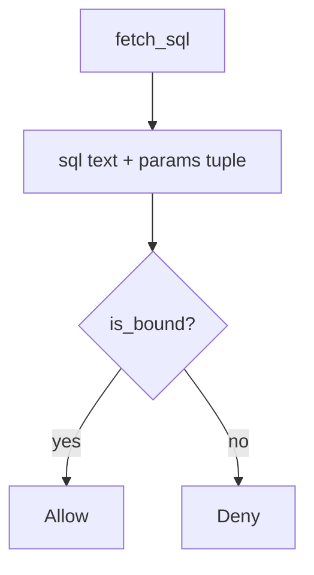

# 5.5-LO-04 — Bind tenant and note id as parameters

**Kind:** design-exercise
**Loop step:** 4 Build
**Standards:** OWASP ASVS 5.0.0 (final) `v5.0.0-1.2.4`.

## Structural means the parser never sees those fields as grammar

`fetch_sql` must return `(sql, params)` with `%s` placeholders and a two-tuple of values. Structural means a bound API — not a denylist of quotes, not “the ORM will handle it.”

## Mental model: program beside data



Fail-safe: if you cannot bind, **do not query**.

## Why this restores the cell

| After the fix | Must be true |
|---|---|
| honest `tA`, `n1` | bound tuple |
| hostile punctuation in `note_id` | still a param, still not a `str` query |
| `is_bound` | true only for the tuple shape |

## What this is not

SQLAlchemy `text()` with an f-string. ORM `.filter` with a raw interpolated string. RLS enabled in production and disabled in tests. Identifier concatenation for ORDER BY (allow-list column names instead).

## Practice

Name the predicate. Run:

```
python3 -m pytest labs/5.5/5.5-lab/tests --impl fixed
```

Must pass.

## Transfer

Clinic: stop treating the search box as SQL text.

## Residual risk

ORDER BY / `COPY` / search DSL; 3.3 role; replicas (5.1); `v5.0.0-16.3.2` Level 3 logging clause advanced.
