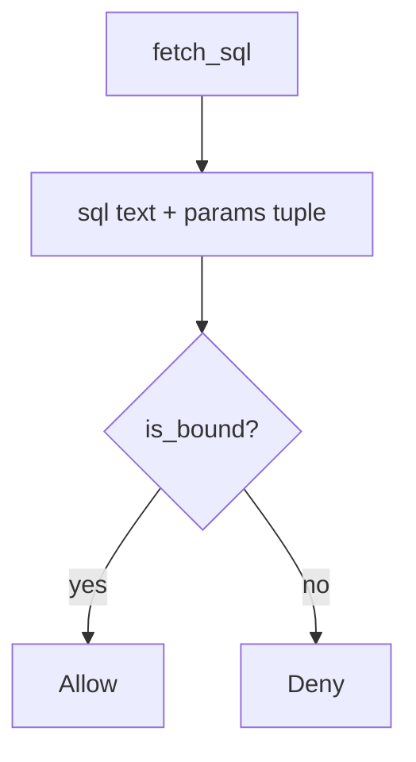

# Bind company and note id as parameters

**Kind:** design-exercise
**Loop step:** 4 Build

## The rule

A denylist of quotes does not make SQL a tuple. “The ORM will handle it” still concatenates. A later row-level rule on in production and off in tests is a different environment.

In plain words, the parser never sees those fields as grammar. Bind tenant and note id as parameters. `fetch_sql` must return `(sql, params)` with `%s` placeholders and a two-tuple of values.

Put this in note fetch: program beside data. If you cannot bind, **do not query**. An id that “looks like a UUID” is not a bind.

## Picture: program beside data



The query is `tenant=%s AND id=%s` with a `(tenant, note_id)` tuple. Object grants (4.4) and a 3.3 database role remain *second* checks. Identifier concatenation for ORDER BY stays leftover: allow-list column names instead of binding them as values. NoSQL operators and GraphQL arguments wait for 7.1 as the same shape.

Use parameterized queries — `fetch_sql`.

## What the repaired files must show

Do not treat `fixed/query.py` as a production query builder.

| After the fix | Must be true |
|---|---|
| honest `tA`, `n1` | bound tuple |
| hostile punctuation in `note_id` | still a param, still not a `str` query |
| `is_bound` | true only for the tuple shape |

When you cannot bind, the answer is no query. A well-formed id is not a bind.

## What this is not

SQLAlchemy `text()` with an f-string. ORM `.filter` with a raw interpolated string. A later row-level rule as a substitute. Quote denylist. Web-filter signature. Scanner “parameterized” badge.

## What the tool cannot do

- ORDER BY / `COPY` / search language still mix identifiers with grammar unless allow-listed.
- 3.3 database role and 4.4 object grants remain required; this check is the interpreter.
- Replicas and backups (5.1) can still hold changed rows if concatenation already ran.
- `%s` *inside a concatenated string* is not `is_bound`.
- Advanced who-is-allowed-decision logging is not this practice.

## Practice

Name the check (`tuple` ∧ `"%s"` in sql ∧ params length 2). Run:

```text
python3 -m pytest labs/5.5/5.5-lab/tests --impl fixed
```

## Use it somewhere new

Stop treating the search box as SQL text; bind the lookup string.

## What can still go wrong

ORDER BY identifiers; replicas; row-level-rule theater; 3.3 role still required; 7.1 same shape.

## What this page is not doing

Do not connect a live company. A check-in is not an ORM brand.
