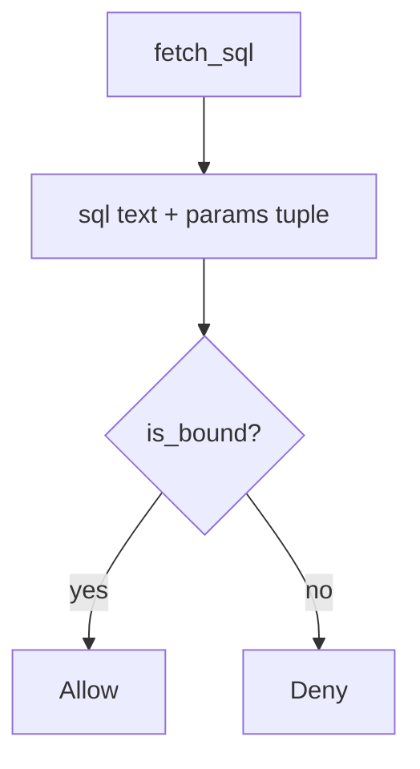

# 5.5-LO-04 — Bind tenant and note id as parameters

**Kind:** design-exercise
**Loop step:** 4 Build
**Standards:** OWASP ASVS 5.0.0 (final) `v5.0.0-1.2.4`. `v5.0.0-16.3.2` Level 3 clause is **advanced**.

## Structural means the parser never sees those fields as grammar

`fetch_sql` must return `(sql, params)` with `%s` placeholders and a two-tuple of values. Structural means a bound API — not a denylist of quotes, not “the ORM will handle it,” not RLS enabled in production and disabled in tests.

The smallest restore for SecureCollab Phase 1 note fetch is: program beside data. Fail-safe: if you cannot bind, **do not query**. Do not fail open because the id “looks like a UUID.”

## Mental model: program beside data



The lab’s fixed tree returns `("SELECT … tenant=%s AND id=%s", (tenant, note_id))`. Production still needs 1.2 object grants (4.4) and a 3.3 database role as *second* gates. Identifier concatenation for ORDER BY stays a residual: allow-list column names instead of binding them as values. NoSQL operators and GraphQL arguments wait for 7.1 as the same shape.

ASVS `v5.0.0-1.2.4` wants parameterized queries. This pytest is that sentence for `fetch_sql`.

## Why this restores the cell

| After the fix | Must be true |
|---|---|
| honest `tA`, `n1` | bound tuple |
| hostile punctuation in `note_id` | still a param, still not a `str` query |
| `is_bound` | true only for the tuple shape |

## What this is not

SQLAlchemy `text()` with an f-string. ORM `.filter` with a raw interpolated string. RLS as a substitute. Quote denylist. WAF signature. Scanner “parameterized” badge.

## Mechanism limits

- ORDER BY / `COPY` / search DSL still mix identifiers with grammar unless allow-listed.
- 3.3 database role and 4.4 object grants remain required; this cell is the interpreter.
- Replicas and backups (5.1) can still hold mutated rows if concatenation already ran.
- `%s` *inside a concatenated string* is not `is_bound`.
- Level 3 authorization-decision logging (`v5.0.0-16.3.2`) is not this fixture.

## Practice

Name the predicate (`tuple` ∧ `"%s"` in sql ∧ params length 2). Run:

```text
python3 -m pytest labs/5.5/5.5-lab/tests --impl fixed
```

Must pass.

## Transfer

Clinic: stop treating the search box as SQL text; bind the lookup string.

## Residual risk

ORDER BY identifiers; replicas; RLS theater; 3.3 role still required; 7.1 same shape.

## Non-goals

Do not connect a live tenant. Do not claim Gate 5 from an ORM brand.
