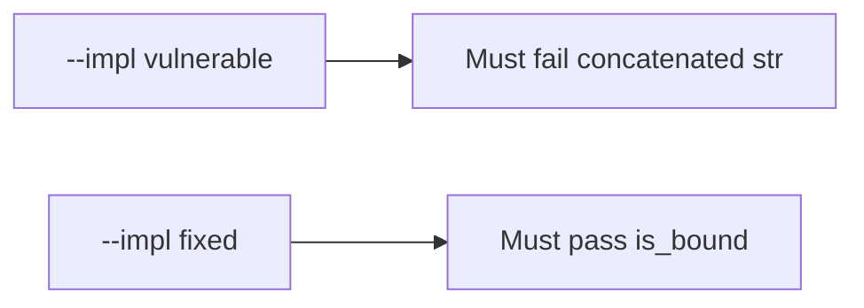

# 5.5-LO-05 — Evidence is a bound tuple, then a passing pair

**Kind:** verification-lab
**Loop step:** 5 Verify
**Standards:** OWASP ASVS 5.0.0 (final) `v5.0.0-1.2.4`.

## An invariant that cannot fail a test is still a slogan

“We parameterized queries” is not evidence. “ORM is on” is a mechanism observation. The oracle is: `fetch_sql` is not a `str`, and `is_bound` is true for the `(sql, params)` shape. That observation must be **false** on `--impl vulnerable` (returns concatenated SQL) and **true** on `--impl fixed`.

## Mental model: vulnerable must fail: concatenated str

The failing observation on `--impl vulnerable` is **concatenated str**. A passing collection count is not this cell.



| Mode | Must show for this module |
|---|---|
| Normal | honest tenant and note id are still a bound tuple |
| Negative / abuse | concatenated SQL is not bound; hostile punctuation stays a param |
| Not claimed | ORDER BY identifiers; live RLS; NoSQL operators |

Lab tests in `labs/5.5/5.5-lab/tests/test_property.py`. `test_query_is_bound_not_concatenated` is a **forbidden-outcome** test: a concatenated `str` is not allowed to count as a passing control. The hostile `note_id` in that test is **data** for the params tuple — not a cookbook to paste into a live query.

```text
python3 -m pytest labs/5.5/5.5-lab/tests --impl vulnerable
python3 -m pytest labs/5.5/5.5-lab/tests --impl fixed
```

Honest bound shape must pass on fixed. Concatenated `str` must fail on vulnerable. If vulnerable does not fail the `isinstance(q, str)` branch, the lab is miswired—fix the wiring, not the assertion.

## What the tests do not prove

- Identifier allow-lists for ORDER BY (named residual)
- Cross-tenant 1.2 without a stolen query (3.3 / 4.4)
- Backup/restore of mutated rows (5.1)
- Level 3 authorization-decision logging (`v5.0.0-16.3.2`)
- GraphQL / NoSQL operator injection (7.1)

Record those as residuals or later modules, not as silent passes.

## Practice

Execute both implementations this session. Write the fail/pass pair next to the matrix row. Reject a “test” that only greps `%s` inside a concatenated string without asserting the tuple shape.

## Transfer

Clinic search box. A test that only asserts HTTP 200 is not this cell (see 9.3). A test that hits a live EHR is out of scope.

## Non-goals

Do not add a live SQL trophy. Do not log bound parameter values that are bodies. Keys stay out of this file.
