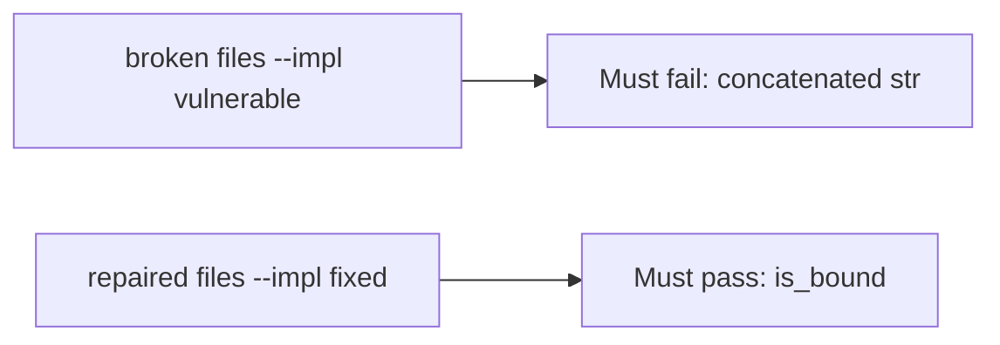

# Fail on the broken files, then pass on the repaired ones

**Kind:** verification-lab
**Loop step:** 5 Verify

## If you cannot test it, it is still a slogan

“We parameterized queries” is not evidence. “ORM is on” is a tool observation. The check is: `fetch_sql` is not a `str`, and `is_bound` is true for the `(sql, params)` shape. That observation must be **false** on the broken files (returns concatenated SQL) and **true** on the repaired files.

## Picture: concatenated SQL must fail the check

A test that only counts passing cases can pass while the query is still glued. This check asks whether concatenated SQL still counts as a passing control. Broken must fail that question. Repaired must pass it.



If both pass, the test is not looking at concatenated SQL. If both fail, the fix is not structural or the check is wrong.

## Four modes, even for one fetch

| Mode | Must show for this topic |
|---|---|
| Normal | Honest company and note id are still a bound tuple |
| Wrong input / abuse | Concatenated SQL is not bound; hostile punctuation stays a param |
| Failure | If you cannot bind, do not query |
| Not claimed | ORDER BY identifiers; live row-level rules; NoSQL operators |

The file is `labs/5.5/5.5-lab/tests/test_property.py`. The test `test_query_is_bound_not_concatenated` is a **what-must-not-happen** test: a concatenated `str` is not allowed to count as a passing control. The hostile `note_id` in that test is **data** for the params tuple — a class of extra grammar, not a cookbook to paste into a live query.

A test that only asserts HTTP 200 is not this topic's evidence. A test that only greps `%s` inside a concatenated string without asserting the tuple shape is not this topic's evidence. This practice never opens a live database.

```text
python3 -m pytest labs/5.5/5.5-lab/tests --impl vulnerable
python3 -m pytest labs/5.5/5.5-lab/tests --impl fixed
```

Honest bound shape must pass on repaired. Concatenated `str` must fail on broken. If the broken files do not fail the `isinstance(q, str)` branch, the lab is miswired — fix the wiring, not the assertion. An environment error is not security evidence.

## What the tests do not prove

- Identifier allow-lists for ORDER BY (named leftover)
- Cross-company 1.2 without a stolen query (3.3 / 4.4)
- Backup/restore of changed rows (5.1)
- Advanced who-is-allowed-decision logging
- GraphQL / NoSQL operator injection (7.1)

Record those as leftover or later topics, not as silent passes.

## Practice

Run both this session:

```text
python3 -m pytest labs/5.5/5.5-lab/tests --impl vulnerable
python3 -m pytest labs/5.5/5.5-lab/tests --impl fixed
```

Paste nothing from answer keys. Write fail/pass into your notes next to the matrix row. Reject a “test” that only greps `%s` inside a concatenated string without asserting the tuple shape.

## Use it somewhere new

Clinic search box. A test that only asserts HTTP 200 is not this check (see 9.3). A test that hits a live clinic system is out of scope.

## What this page is not doing

Do not add a live SQL trophy. Do not log bound parameter values that are bodies. Answer keys are not on this site.
