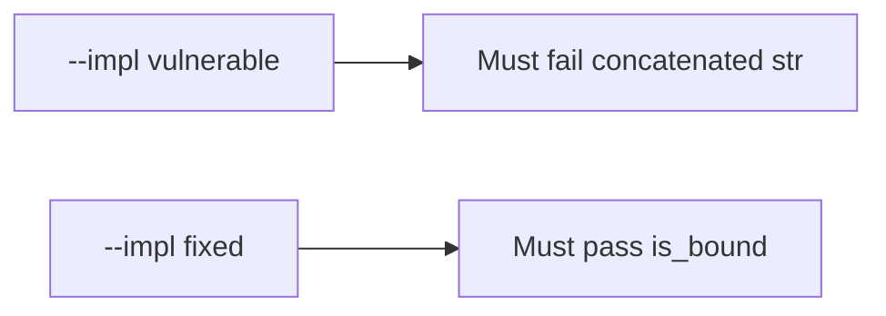

# 5.5-LO-05 — Evidence is a bound tuple, then a passing pair

**Kind:** verification-lab
**Loop step:** 5 Verify
**Standards:** OWASP ASVS 5.0.0 (final) `v5.0.0-1.2.4`.

## An invariant that cannot fail a test is still a slogan

“We parameterized queries” is not evidence. The oracle is the local pair.

## Mental model: vulnerable must fail: concatenated str

The failing observation on `--impl vulnerable` is **concatenated str**. A passing collection count is not this cell.



| Case | Must show |
|---|---|
| Negative / abuse | concatenated SQL is not bound |
| Normal | honest tenant and note id are still a bound tuple |
| Not claimed | ORDER BY identifiers; live RLS; NoSQL operators |

```
python3 -m pytest labs/5.5/5.5-lab/tests --impl vulnerable
python3 -m pytest labs/5.5/5.5-lab/tests --impl fixed
```

Honest bound shape must pass on fixed. Concatenated `str` must fail on vulnerable.

## What the tests do not prove

- Identifier allow-lists for ORDER BY (named residual)
- Cross-tenant 1.2 without a stolen query (3.3 / 4.4)
- Backup/restore of mutated rows (5.1)
- Level 3 authorization-decision logging (`v5.0.0-16.3.2`)

## Practice

Execute both implementations. Map each test to an LO-02 cell.

## Transfer

Clinic search box. A test that only asserts HTTP 200 is not this cell.
