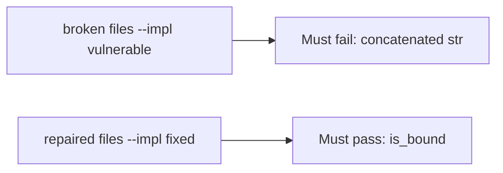

# Glued-together SQL must fail the check

**Kind:** verification-lab
**Loop step:** 5 Verify

## Check it

Saying queries are parameterized does not prove the SQL is a tuple. An ORM toggle is a product. `fetch_sql` must not be a `str`, and `is_bound` has to be true for the `(sql, params)` shape. On the broken helper, the helper returns concatenated SQL. Repair returns `(sql, params)`.

## Picture: concatenated SQL must fail the check

A glued query can still ship while the rest of the tests pass.



If the broken report still passes, concatenated SQL was never the failing query.

## What the check has to show

| Mode | Must show for this topic |
|---|---|
| Normal | Honest company and note id are still a bound tuple |
| Wrong input / abuse | Concatenated SQL is not bound; hostile punctuation stays a param |
| Failure | If you cannot bind, do not query |
| Not claimed | ORDER BY identifiers; live row-level rules; NoSQL operators |

`test_query_is_bound_not_concatenated` catches a concatenated `str`. The hostile `note_id` in that test is **data** for the params tuple — a class of extra grammar, not a cookbook to paste into a live query.

A `%s` inside concatenated SQL is not the `(sql, params)` shape. This practice never opens a live database.

```text
python3 -m pytest labs/5.5/5.5-lab/tests --impl vulnerable
python3 -m pytest labs/5.5/5.5-lab/tests --impl fixed
```

Honest bound shape must pass on repaired. Concatenated `str` must fail on broken. If the broken files do not fail the `isinstance(q, str)` branch, the lab is miswired — fix the wiring, not the assertion. A setup error is not proof the rule holds.

## What the tests do not prove

- Identifier allow-lists for ORDER BY (named leftover)
- Cross-company 1.2 without a stolen query (3.3 / 4.4)
- Backup/restore of changed rows (5.1)
- Advanced who-is-allowed-decision logging
- GraphQL / NoSQL operator injection (7.1)

## Practice

Assert the `(sql, params)` shape. A `%s` inside concatenated SQL is still a string.

## Use it somewhere new

A green search still can be concatenated SQL. Do not run a test that hits a live clinic system.

## What this page is not doing

A live SQL screenshot is not the bound tuple. Do not log bound parameter values that are bodies. Answer keys are not on this site.
