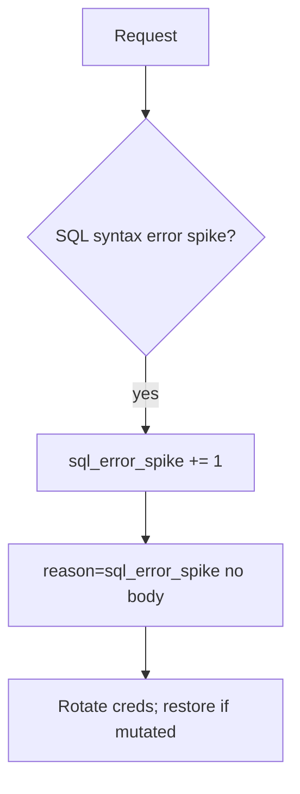

# Notice a SQL error spike; restore if mutated

**Kind:** operations-exercise
**Loop step:** 6 Operate

## Fixing it once is not enough

Even after `fetch_sql` was repaired once, a new report path can concatenate again. Then notice the concatenated report, contain the path, rotate the account, and restore if rows were changed.

Do not log note bodies or bound parameter values that are bodies (3.1 / 5.1). Do not paste patient names into the ticket.

## Picture: error shape is a signal

If SQL syntax errors spike after a query helper change, keep note bodies out of the pager. Then stop the concatenating path and restore if needed.



A vendor name does not bind parameters. Someone still has to own the concatenating path.

## Signals that do not become a second leak

| Outcome | This topic |
|---|---|
| Notice | `sql_error_spike`; `grant_drift` (3.3) |
| What the line holds | request id, company id, statement **name** — **never** the body |
| Respond | Stop the concatenating path |
| Recover | Rotate database passwords; restore from backup if rows were changed; re-run `test_query_is_bound_not_concatenated` |
| Leftover | Superuser tools; replicas that were not restored |

```text
log_denied reason=sql_error_spike tenant=tA request_id=req_55q stmt=fetch_note
```

Not: a note body, a full SQL string with values, a real email, or “the web filter caught it.”

Putting a full SQL string with values in the alert leaves the query text in the pager too.

A web-filter SQLi rule does not bind the query helper. Report paths and ORDER BY builders are other concatenating paths — list those before you call SQL safe. If a replica was not restored, treat it as the same leftover, not a separate “eventual consistency” pass.

## What the framework does vs what you still have to check

A web filter will page on syntax errors and stay silent when the values were concatenated but happened to parse. Detection must observe **concatenated `str` from `fetch_sql`**, not HTTP 500 counts. If the alert includes a full SQL string with values, you have opened a leftover hole from topic 3.1.

## Practice

Write a log line (ids, reason, statement name, no body). Reject any line that includes a note body, a full SQL string with values, or a real email.

## Use it somewhere new

Notice search-box syntax errors; do not paste patient names into the ticket. Do not hit a live clinic system.

## What this page is not doing

A web filter does not bind parameters. Do not use live SQL hunts. This site does not mark you as finished. Answer keys are not on this site.
