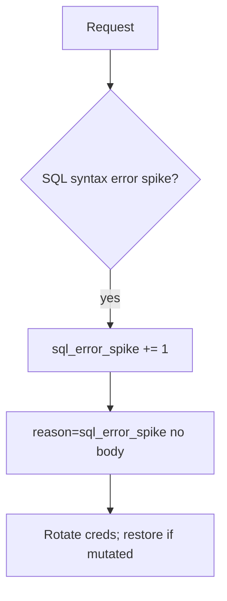

# Notice a SQL error spike; restore if mutated

**Kind:** operations-exercise
**Loop step:** 6 Operate

## Stopping it is not enough

Even after `fetch_sql` was “fixed once,” a new report path can concatenate again. Running it for real is the rest of the loop: notice, contain, rotate, and restore if rows were changed.

Do not log note bodies or bound parameter values that are bodies (3.1 / 5.1). Do not paste patient names into the ticket.

## Picture: error shape is a signal

A SQL syntax-error spike after a query helper change is a notice-and-recover problem, not a licence to quote note bodies in the paging channel. Notice names the event. Recover stops the concatenating path and restores if needed. Neither reprints the body.



Industry lists name detect, respond, recover. They do not bind parameters. A log-product name is not the rule. Someone still has to own the concatenating path.

## Signals that do not become a second leak

| Outcome | This topic |
|---|---|
| Notice | `sql_error_spike`; `grant_drift` (3.3) |
| What the line holds | request id, company id, statement **name** — **never** the body |
| Respond | Stop the concatenating path |
| Recover | Rotate database passwords; restore from backup if rows were changed; re-run `test_query_is_bound_not_concatenated` |
| Leftover | Superuser tools; replicas that were not restored |

A log line a reviewer can accept looks like:

```text
log_denied reason=sql_error_spike tenant=tA request_id=req_55q stmt=fetch_note
```

Not: a note body, a full SQL string with values, a real email, or “the web filter caught it.”

If your alert includes a full SQL string with values, you have opened a second leak in the paging channel.

A green “web-filter SQLi rule” tile is not that pytest. Report paths and ORDER BY builders are other paths of the same check — inventory them before claiming recover. If a replica was not restored, treat it as the same leftover, not a separate “eventual consistency” pass.

## What the framework does vs what you still have to check

A web filter will page on syntax errors and stay silent when the values were concatenated but happened to parse. Detection must observe **concatenated `str` from `fetch_sql`**, not HTTP 500 counts. If the alert includes a full SQL string with values, you have opened a 3.1 cell.

## Practice

Write one log line you would accept in review (ids, reason, statement name, no body). Tie it to `labs/5.5/5.5-lab`. Reject any line that includes a note body, a full SQL string with values, or a real email.

## Use it somewhere new

Clinic: notice search-box syntax errors; do not paste patient names into the ticket. Do not hit a live clinic system.

## What this page is not doing

A log-product name is not the rule. A web filter is not this check. Live SQL hunts are out of scope. Course gates stay unclaimed. Answer keys stay out of lessons.
