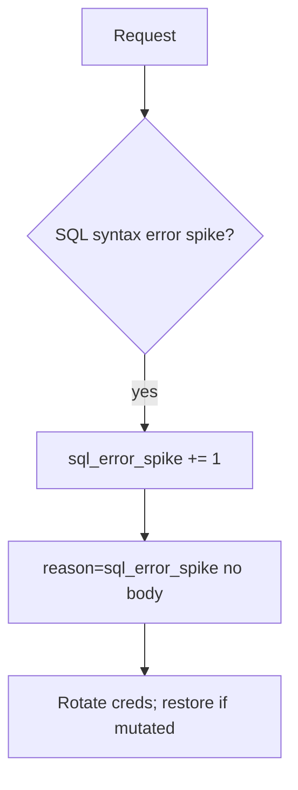

# 5.5-LO-06 — Detect sql_error_spike; restore if mutated

**Kind:** operations-exercise
**Loop step:** 6 Operate
**Standards:** NIST CSF 2.0 (final) DE/RS/RC as outcome labels; OWASP ASVS 5.0.0 (final) `v5.0.0-1.2.4`. `v5.0.0-16.3.2` Level 3 clause is **advanced**.

## Prevention is not absolute

A new report path can concatenate again. Pair detect and recover. Do not log note bodies or bound parameter values that are bodies (3.1 / 5.1).

## Mental model: error shape is a signal



| Outcome | This module |
|---|---|
| Detect | `sql_error_spike`; `grant_drift` (3.3) |
| Signal | request id, tenant id, statement **name**; never the body |
| Recover | Stop the concatenating path; rotate DB creds; restore from backup if rows mutated |
| Residual | Superuser tools; replicas that were not restored |

## Practice

Write one log line you would accept. Tie it to `labs/5.5/5.5-lab`.

```
log_denied reason=sql_error_spike tenant=tA request_id=req_55q stmt=fetch_note
```

Reject any line that includes a note body, a full SQL string with values, or a real email.

## Transfer

Clinic: detect search-box syntax errors; do not paste patient names into the ticket.

## Non-goals

SIEM product names are not the property. WAF is not this cell.
