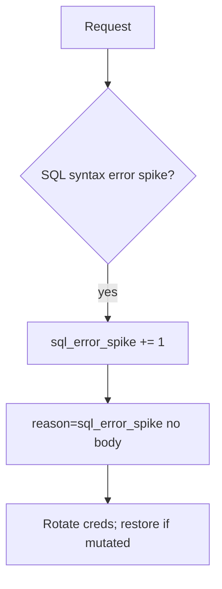

# Notice a SQL error spike; restore if mutated

**Kind:** operations-exercise
**Loop step:** 6 Operate

## Fixing it once is not enough

A new report path can concatenate after `fetch_sql` is bound. Notice that report, contain the path, rotate the account, and restore if rows changed.

Keep note bodies, bound parameter values that are bodies, and patient names out of the ticket.

## Picture: error shape is a signal

If SQL syntax errors spike after a query helper change, page the concatenating helper — never the note text. Then stop the concatenating path and restore if needed.



A web-filter SQLi rule does not bind `fetch_sql`.

## Signals that do not become a second leak

| Outcome | This topic |
|---|---|
| Notice | `sql_error_spike`; `grant_drift` (3.3) |
| What the line holds | request id, company id, statement **name** — **never** the body |
| Respond | Stop the concatenating path |
| Recover | Rotate database passwords; restore from backup if rows were changed; re-run `test_query_is_bound_not_concatenated` |
| Leftover | Superuser tools; replicas that were not restored |

```text
log_denied reason=sql_error_spike tenant=tA request_id=req_55q stmt=fetch_note
```

A note body, a full SQL string with values, a real email, or “the web filter caught it” in the sample still holds bound values.

A full SQL string with values in the concat-deny ticket is the query itself.

A web-filter SQLi rule does not bind the query helper. Report paths and ORDER BY builders still concatenate if you only bound `fetch_sql`. If a replica was not restored, treat it as the same leftover, not a separate “eventual consistency” pass.

## What the framework does vs what you still have to check

Syntax-error paging on a web filter skips concatenated values that happened to parse. Catch **concatenated `str` from `fetch_sql`**, not HTTP 500 counts. A full SQL string with values on the concat metric reopens topic 3.1.

## Practice

Log ids, a reason, and the statement name — never bound values. A note body, a full SQL string with values, or a real email still holds those values.

## Use it somewhere new

Notice search-box syntax errors; do not paste patient names into the ticket. Do not hit a live clinic system.

## What this page is not doing

A web filter does not bind parameters. Do not use live SQL hunts. This site does not mark you as finished. Answer keys are not on this site.
