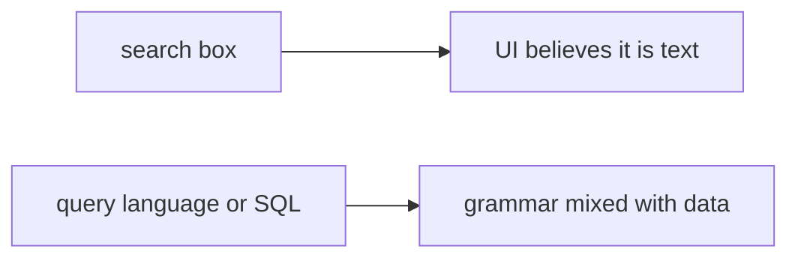

# Same idea on a clinic search box

**Kind:** transfer-challenge
**Loop step:** 7 Transfer

## Use it somewhere new

You get a **clinic search box** that builds a patient lookup.

`fetch_sql` returns a bound pair, not a concatenated string. Bind tenant and note id as parameters. For a clinic, the lookup helper returns bound values, not glued query text.

Also name NoSQL operators and GraphQL arguments as the same shape (7.1), without running those systems.

## Picture: the search box is still an interpreter

The search box is the note id in the query.

| Notes app | Clinic sketch |
|---|---|
| `note_id` glued into SQL | Search-box text glued into SQL or a query language |
| `fetch_sql` | Patient-lookup helper |
| Bound `(sql, params)` | Bound lookup string |
| Member supplying note id | Clinician or kiosk user supplying search text — **not** a live clinic |

If the search box is concatenated into SQL (or into a query language), the check is gone. FastAPI, SQLAlchemy, and “row-level security is on” do not bind the box. Quote denylists fail the encoding lesson from 2.1. GraphQL arguments and NoSQL operators are the same shape in 7.1 — name them, do not run those systems here.

The lookup helper returns `(sql, params)` (or an ORM bound construct), not a concatenated `str`. Switching to SQLAlchemy while interpolating the box into `text()` leaves the interpreter mixed. The local check is `test_query_is_bound_not_concatenated` — on a practice, not a live clinic system.

## Write this for a clinic search box

1. who might try (clinician or kiosk user supplying search text — not a live clinic);
2. what you trust (which API binds values; the ORM brand is not);
3. what must not happen (`fetch`-like function returns concatenated query text);
4. bound query is a tuple, not concatenated str — **local** practice files (never on the real clinic);
5. leftover (ORDER BY identifiers; replicas; row-level-rule theater; advanced logging);
6. whether a human-read “search failed” status must not use color as the only cue (readable error, not a silent empty list that hides a parser crash).

## What is not good enough

| Reject | Why |
|---|---|
| “ORM is on” | Brand theater |
| Live clinic probe | Course rules |
| Row-level rule as the rule | Extra check, not this rule |
| HTTP 200 as binding evidence | Wrong observation |
| Scanner name as the rule | Awareness after the cause |

## Practice

Bind the report query the way you bound `fetch_sql`. Keep the answer keys closed. The only running system you may break is `labs/5.5/5.5-lab`. Do not probe a live database.

## What this page is not doing

Do not try live-target SQL. Do not use real patient rows. This page does not finish a check-in.
