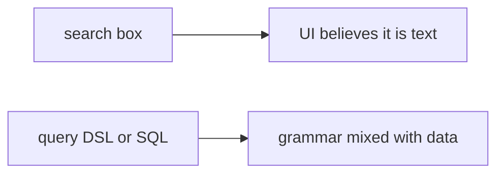

# 5.5-LO-07 — Transfer: clinic search box

**Kind:** transfer-challenge
**Loop step:** 7 Transfer
**Standards:** OWASP ASVS 5.0.0 (final) `v5.0.0-1.2.4`. NoSQL/GraphQL wait for 7.1.

## Change the workplace; keep data-vs-grammar

Do not answer with a Top 10 / CWE / scanner as the definition of security.

**Prompt:** Clinic search box that builds a patient lookup. Also name NoSQL operators and GraphQL arguments as the same shape (7.1), without running those systems.

**Product sketch:** EHR-lite “quick search” that concatenates the box into SQL or into a query DSL.

Rewrite the SecureCollab sentence. Include:

1. attacker capabilities (clinician or kiosk user supplying search text — not a live clinic);
2. trust assumptions (which API binds values; the ORM brand is not TCB);
3. forbidden outcome (`fetch`-like function returns concatenated query text, not “HIPAA”);
4. a test idea on a **local** fixture only;
5. residual (ORDER BY identifiers; replicas; RLS theater; Level 3 logging);
6. WCAG if a human “search failed” path is in the claim (readable error, not a silent empty list that hides a parser crash).

## Mental model: the search box is still an interpreter

## What graders reject

| Reject | Why |
|---|---|
| “ORM is on” | Brand theater |
| Live clinic probe | Lab policy |
| RLS as the property | Extra gate, not this cell |

## Practice

One page. No keys. `labs/5.5/5.5-lab` is the only running system you may break.
