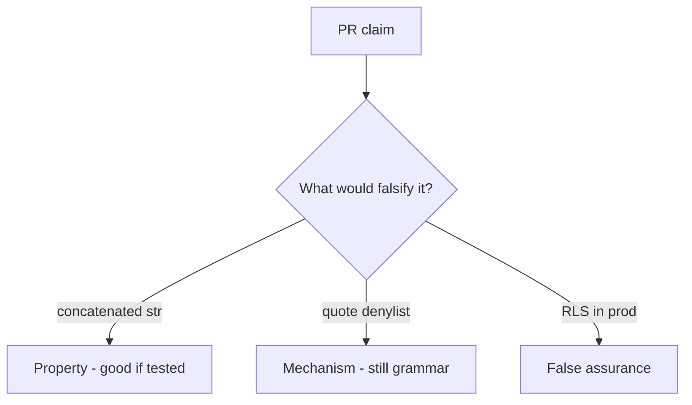

# 5.5-LO-08 — Review concatenated fetch_sql as a PR, not a scanner ticket

**Kind:** code-review
**Loop step:** Review
**Standards:** OWASP ASVS 5.0.0 (final) `v5.0.0-1.2.4`.

## Review the fixture as if it were SecureCollab persistence

Review `labs/5.5/5.5-lab/vulnerable/` as a SecureCollab PR. Intended findings live only in `content/assessment/keys/5.5.md` — not here.

## Mental model: f-string SELECT that interpolates note_id

Start with this seeded smell: **f-string `SELECT` that interpolates `note_id`**. Label it property, mechanism, or false assurance before you accept the PR.

Seeded smells (label them yourself; do not open the keys file):

- f-string `SELECT` that interpolates `note_id`
- ORM `.filter` with raw strings
- RLS disabled in tests “for speed” and forgotten
- No `is_bound` assertion

Also reject: live SQL attacks, keys in lessons, WAF as the property.

## Misconceptions

- ORM means no injection
- RLS replaces parameterization
- Blacklist of quotes is mediation

## Practice

Write three review notes. Tie at least one to `test_query_is_bound_not_concatenated`.

## Transfer

Clinic PR that “switched to SQLAlchemy” without a bound-tuple test is incomplete.
