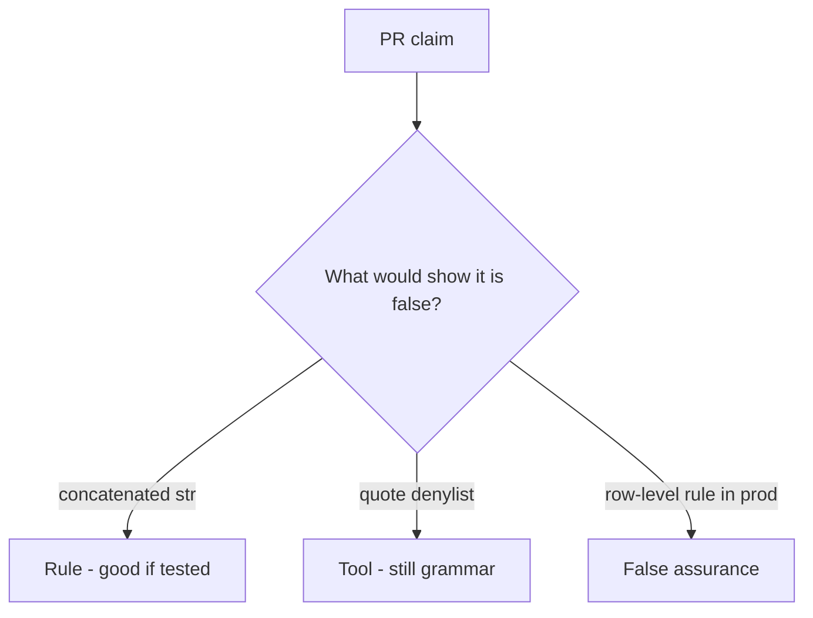

# Review of concatenated SQL

**Kind:** code-review
**Loop step:** Review

## What you are reviewing

Start at concatenated SQL. Mark each claim **rule**, **tool**, or **false assurance**, and say whether `fetch_sql` still returns a `str` if they ship. An ORM sticker is not the review.

Do not treat “will parameterize later” as a green `test_query_is_bound_not_concatenated`.

## Picture: problems to find (name them yourself)

**f-string `SELECT` that interpolates `note_id`**.

`fetch_sql` is a bound tuple. If the change never uses a params tuple, that grammar mix is still open. `%s` inside a concatenated string is still the same problem.

## Problems to find (name them yourself)

- f-string `SELECT` that interpolates `note_id`
- ORM `.filter` with raw strings
- Row-level rule disabled in tests “for speed” and forgotten
- No `is_bound` assertion

Also reject: live SQL attacks; closing findings without re-running `test_query_is_bound_not_concatenated`; keys in learner notes; web filter as the rule; payload cookbooks in the change.

## Common mix-ups

- ORM means no injection
- A later row-level rule replaces parameterization
- A denylist of quotes is complete mediation
- A SQL-injection finding is the bound tuple
- HTTP 500 absence means the query was bound

## Use it somewhere new

Switching to SQLAlchemy without a bound-tuple test still concatenates SQL. What still has to be false so `fetch_sql` is not a concatenated `str`?

## What this page is not doing

A concatenation path with only “will parameterize later” has no owner. Do not probe a live database to prove the finding.
