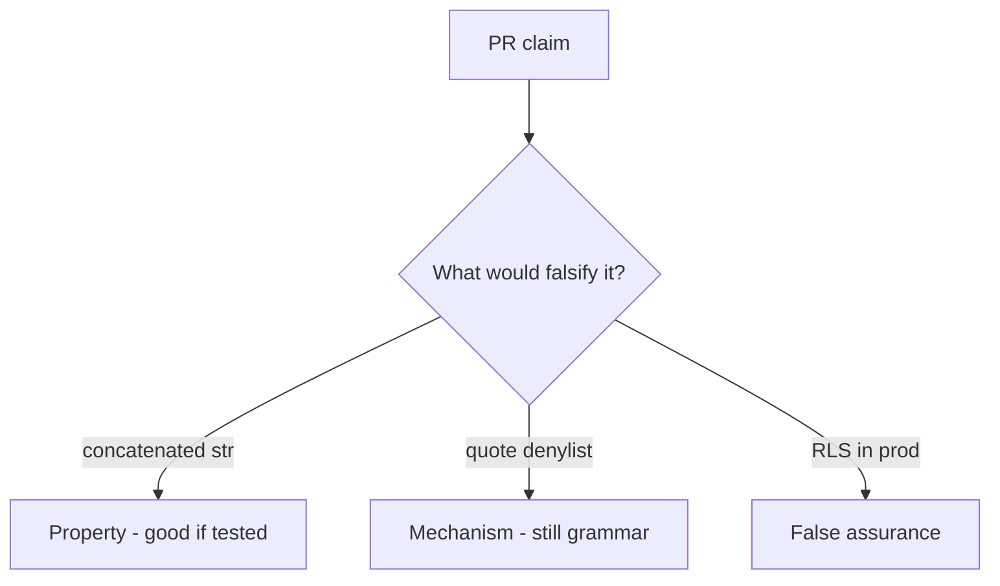

# 5.5-LO-08 — Review concatenated fetch_sql as a PR, not a scanner ticket

**Kind:** code-review
**Loop step:** Review
**Standards:** OWASP ASVS 5.0.0 (final) `v5.0.0-1.2.4`.

## Review the fixture as if it were SecureCollab persistence

Review `labs/5.5/5.5-lab/vulnerable/` as a SecureCollab PR. Your job is not to count suspicious lines. Reconstruct whether `fetch_sql` still returns a concatenated `str`, compare that with the module invariant, and write changes a developer can verify.

Intended findings live only in `content/assessment/keys/5.5.md` — not here. Do not open the keys file until your review has been evaluated.

## Mental model: f-string SELECT that interpolates note_id

Start with this seeded smell: **f-string `SELECT` that interpolates `note_id`**. Label it property, mechanism, or false assurance before you accept the PR.

Classification starts at the protected effect (`fetch_sql` is a bound tuple). Everything that is not a params tuple at that call is a candidate grammar mix. `%s` inside a concatenated string is the same smell, not a different finding class.

## Seeded smells (label them yourself)

- f-string `SELECT` that interpolates `note_id`
- ORM `.filter` with raw strings
- RLS disabled in tests “for speed” and forgotten
- No `is_bound` assertion

Also reject: live SQL attacks; closing findings without re-running `test_query_is_bound_not_concatenated`; keys in lessons; WAF as the property; payload cookbooks in the PR.

## Misconceptions this module refuses

- ORM means no injection
- RLS replaces parameterization
- Blacklist of quotes is mediation
- Scanner finding is the invariant
- HTTP 500 absence means the query was bound

## Practice

Write three review notes a maintainer could act on. Each note: observation, property or false assurance, suggested structural change, residual you will **not** delete. Tie at least one to `test_query_is_bound_not_concatenated`.

## Transfer

Clinic PR that “switched to SQLAlchemy” without a bound-tuple test is an incomplete mediation review. Name the independent falsehood that would still keep `fetch_sql` from returning a `str`.

## Non-goals

Do not merge by adding a comment “will parameterize later.” That comment is a residual without an owner. Do not probe a live database to prove the finding.
