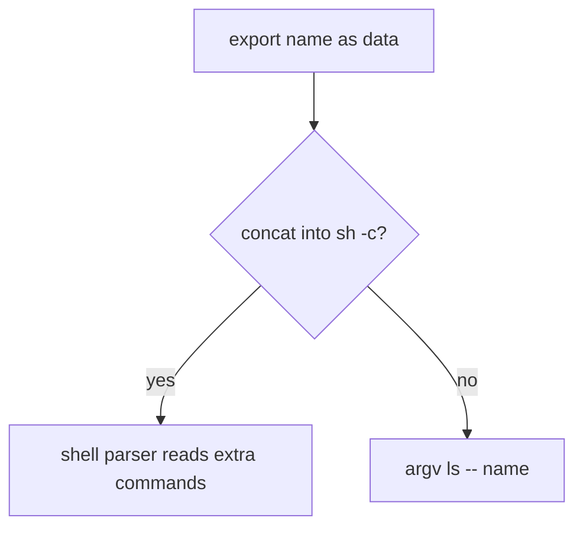
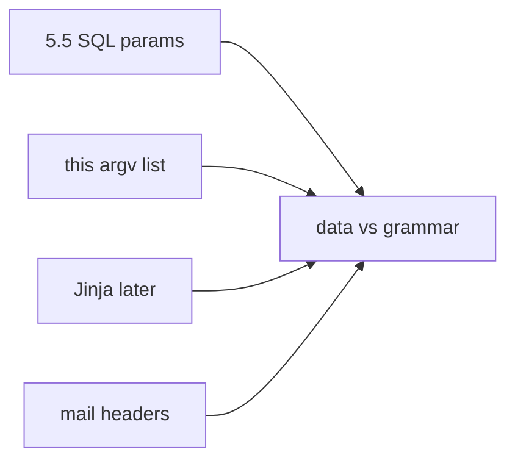

# 6.1-LO-01 — Export name is data, not shell grammar

**Kind:** concept-model
**Loop step:** 1 Property
**Standards:** OWASP ASVS 5.0.0 (final) `v5.0.0-1.2.5`, `v5.0.0-1.2.4` (same shape as 5.5); `v5.0.0-1.2.10` is **Level 3, advanced**. OWASP Top 10:2025 A05 and CWE-77/78/89 are *awareness after* the cause. FastAPI has no opinion about argv.

## The claim this module owns

SecureCollab Phase 1 may list an export directory. The **name is data**. The OS must not parse it as a shell program. Module 5.5 already taught parameters vs SQL grammar; this module’s cell is the same shape at the process boundary.

> `argv_for_list` must not invoke a shell. Structural APIs (argv list, parameterized SQL in 5.5) are the mechanism. A denylist of metacharacters is incomplete (2.1 encodings).

The forbidden outcome is **a user-controlled name executed via a shell string**. That is a 1.1 integrity failure of the OS interpreter boundary. This lab asserts **argv shape only**. It does not run a live OS attack.

ASVS `v5.0.0-1.2.5` wants OS calls that pass arguments as parameters (or, weaker, contextual encoding — this course prefers argv and treats encoding as residual). `v5.0.0-1.2.10` (CSV/formula injection) is **Level 3, advanced** and appears in the clinic transfer, not this fixture.

## Mental model: data vs interpreter grammar



The attacker is a user who chooses a note or export name, or a compromised client. Trust is local `argv.py`. Do not probe other hosts.

**Mechanism (not the property):** `shell=False` as a comment, a denylist of `;` `|`, or a scanner finding.

## Mental model: same shape across interpreters



SQL, shell, templates, and mail headers fail the same way: untrusted data becomes another language’s program.

## Root cause vs impact vs prevention vs detection vs recovery

| Slice | For this property |
|---|---|
| Root cause | Concatenating untrusted data into a shell grammar |
| Preconditions | returns `['sh', '-c', 'ls ' + name]` |
| Trigger | User-chosen name (lab checks shape, not execution) |
| Impact | Integrity of the OS interpreter boundary |
| Prevention | argv list; no shell; `--` before the name |
| Detection | `child_process_anomaly` |
| Recovery | Kill the child; isolate the host if it left the lab (it must not) |

## Framework defaults versus the argv guarantee

Python `subprocess` defaults are easy to misuse (`shell=True`, or a string instead of a list). FastAPI does not mediate OS calls.

## Mechanism limits

- Rejecting `;` `|` still fails on encodings and IFS (2.1).
- Argv without `--` still leaves **argument injection** if the binary treats leading `-` as flags — named residual, not executed here.
- A plugin that truly needs a shell is a separate, isolated binary.

## Practice

Map data flow into each interpreter on the export path. Then run:

```
python3 -m pytest labs/6.1/6.1-lab/tests --impl vulnerable
python3 -m pytest labs/6.1/6.1-lab/tests --impl fixed
```

The first command must fail. The second must pass.

## Transfer

Clinic export-to-CSV filename. Jinja, SQL, mail headers.

## Non-goals

Live command execution, shell metacharacter cookbooks, dumping lab Python into notes. Gates 0–10 and milestones M0–M5 stay **not-attempted**. Answer keys are not in this file.
