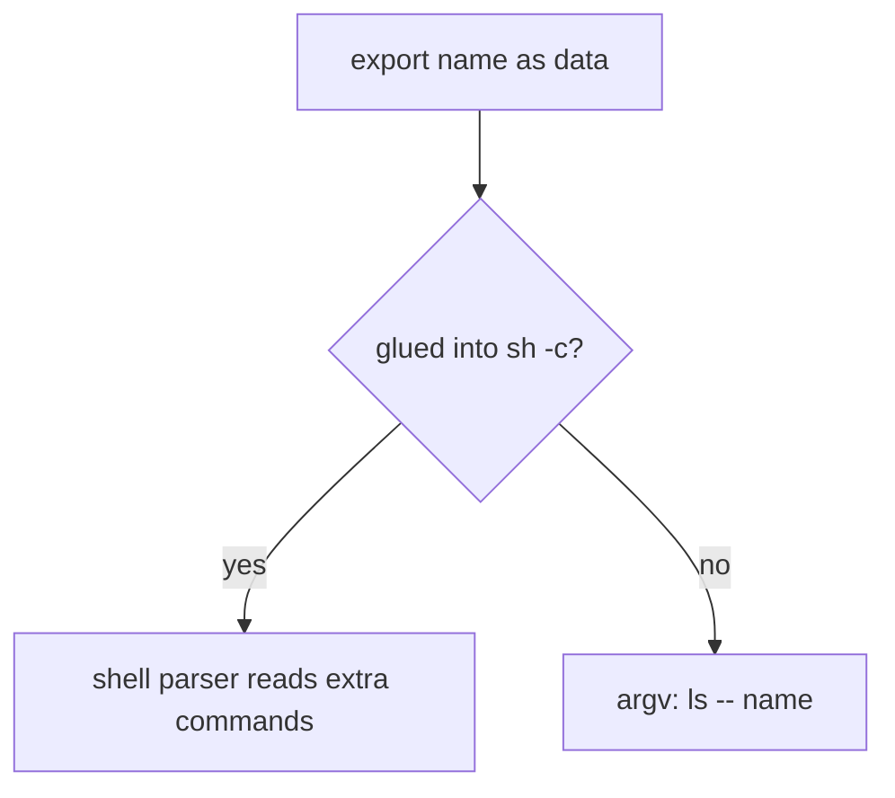
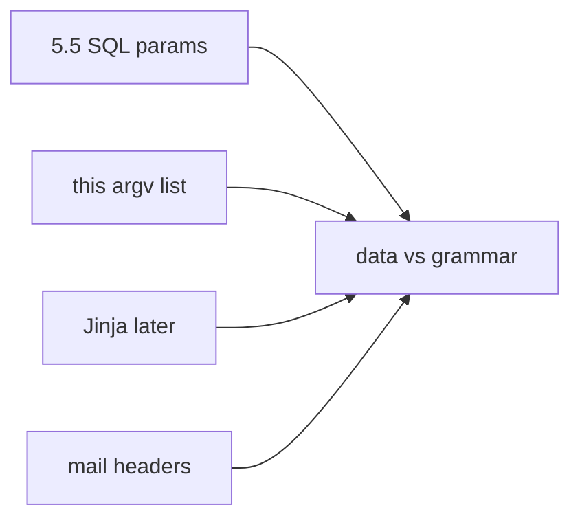

# Export name is data, not a shell command

**Kind:** concept-model
**Loop step:** 1 Property

## The rule

The notes app may list an export folder. The **name is data**. The operating system must not read that name as a shell program. Module 5.5 already taught parameters versus SQL grammar. This week's check is the same shape at the process boundary.

> `argv_for_list` must not start a shell. Pass the name as a list of arguments. A denylist of punctuation is incomplete — encodings from 2.1 still beat string filters.

What must not happen is **a user-chosen name run through a shell string**. That is an integrity failure at the OS interpreter: extra words in the name can become extra commands. This practice checks **argv shape only**. It does not run a live OS command.

OS calls have to pass arguments as parameters. Encoding the name for a shell is a leftover, not this week's check. Formula characters in a CSV file are **advanced** work and show up in the clinic transfer, not this practice. FastAPI has no opinion about argv.

## Picture: data vs shell grammar



Who could do this: a member who chooses a note or export name, or a stolen client. What you trust in this practice: the local `argv.py` helper. Do not probe other hosts.

**The tool (not the rule):** a `shell=False` comment, a denylist of punctuation, or a scanner finding.

## Picture: same shape across interpreters



SQL, shell, templates, and mail headers fail the same way: untrusted data becomes another language's program.

## Why it happens, what it costs, how you stop it, how you notice, how you recover

| Slice | For this rule |
|---|---|
| Why it happens | Concatenating untrusted data into a shell string |
| What has to be true first | `argv_for_list` returns `['sh', '-c', 'ls ' + name]` |
| Trigger | User-chosen name (this practice checks shape, not execution) |
| What it costs | Integrity of the OS interpreter boundary |
| How you stop it | argv list; no shell; `--` before the name |
| How you notice | `child_process_anomaly` |
| How you recover | Kill the child; isolate the host if it left the lab (it must not) |

## What the framework does vs what you still have to check

Python `subprocess` is easy to misuse (`shell=True`, or a string instead of a list). FastAPI does not mediate OS calls. Next.js `child_process.exec` is a shell.

The app's promise: `argv_for_list` is a list whose program is not `sh`. The folder is `labs/6.1/6.1-lab`. Fake names only. No live OS command.

## What the tool cannot do

- Stripping punctuation still fails on encodings and IFS (2.1).
- Argv without `--` still leaves **argument injection** if the binary treats a leading `-` as a flag — named leftover, not executed here.
- A plugin that truly needs a shell is a separate, isolated binary.

## Practice

Map data flow into each interpreter on the export path. Then run:

```text
python3 -m pytest labs/6.1/6.1-lab/tests --impl vulnerable
python3 -m pytest labs/6.1/6.1-lab/tests --impl fixed
```

The first command must fail. The second must pass.

## Use it somewhere new

Clinic export-to-CSV filename. Jinja, SQL, mail headers.

## What this page is not doing

Live command execution, shell-punctuation cookbooks, dumping lab Python into notes. This site does not mark you as finished. Answer keys are not on this site.
