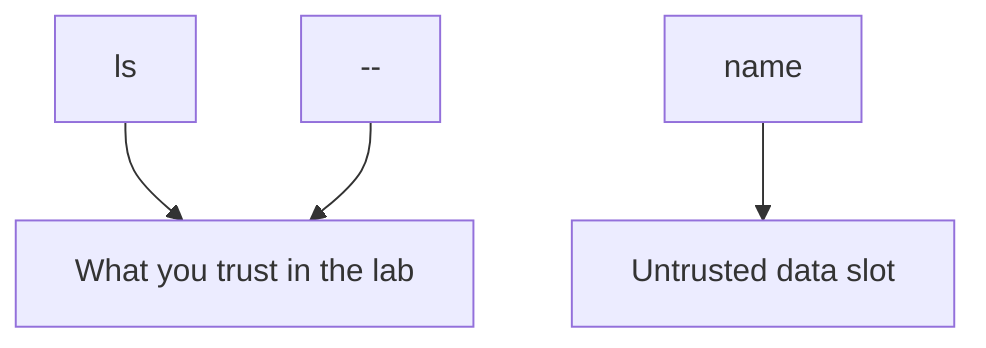
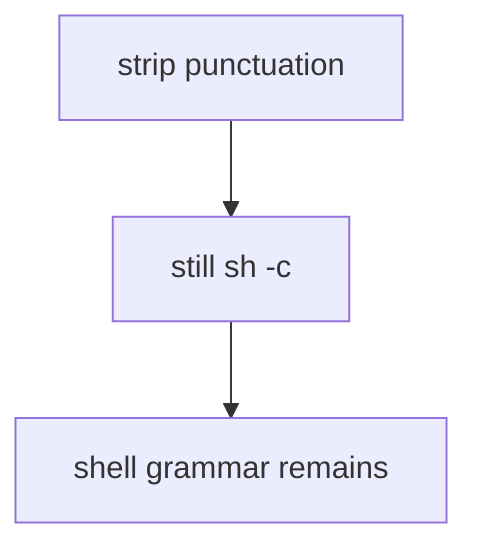

# An argv map someone else can test

**Kind:** design-exercise
**Loop step:** 2 Model

## Could someone else name the checks?

“We don’t use a shell” is not this lesson. A map someone else can test names **which process is started**, **which argv slots are data**, and **which interpreters are out of this practice**.

This week's freeze: local `argv_for_list(name)` and `uses_shell`. No live `ls`.

> Pass the name as one argv element. The program must be a fixed binary. The shell must never see the name as grammar.

## Picture: argv slots, not a string

The program path is chosen by the application. The name occupies one slot. `--` tells the binary that later tokens are operands, not flags (argument-injection leftover).

## Picture: a denylist is not mediation

Module 2.1 already showed encodings beating string filters. This map refuses a punctuation denylist as the rule.

## Step 1: name the pieces

| Piece | This system |
|---|---|
| Who | member choosing an export name |
| What | argv list vs shell string |
| Actions | `argv_for_list`, `uses_shell` |
| Paths | OS process spawn (not executed in tests) |
| What you trust | argv array, `uses_shell is False` |
| What you do not trust | `name` |
| Time | One list call |
| The rule | Integrity of the OS interpreter boundary |

## Step 2: write allow and deny

| Who | What | Action | Decision |
|---|---|---|---|
| app | `ls` | spawn with argv | allow |
| attacker | name | as shell grammar | deny |
| plugin | `/bin/sh` | needed shell | isolate (leftover) |
| export | CSV cells | formula characters | advanced leftover |

A missing “hostile name × shell grammar × deny” row is how `sh -c` concatenation appears. Write the hole.

## Practice

Draw SQL vs shell vs template on one page so someone else could name the pytest cases. Point at `labs/6.1/6.1-lab` file `argv.py`. Fake names only.

## Use it somewhere new

Clinic CSV filename as a second interpreter. Jinja includes.

## What can still go wrong

Argument injection; plugin shells; formula characters in CSV cells.

## What this page is not doing

Do not define security as a famous-bugs list. Do not run this map against a live clinic or a live export worker. Answer keys stay out of lessons.
