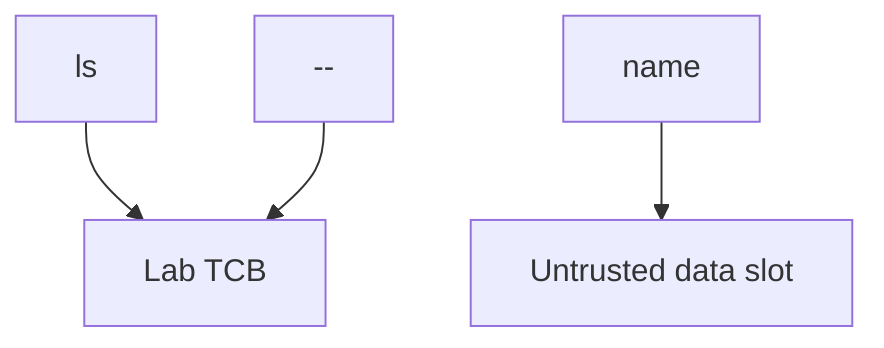
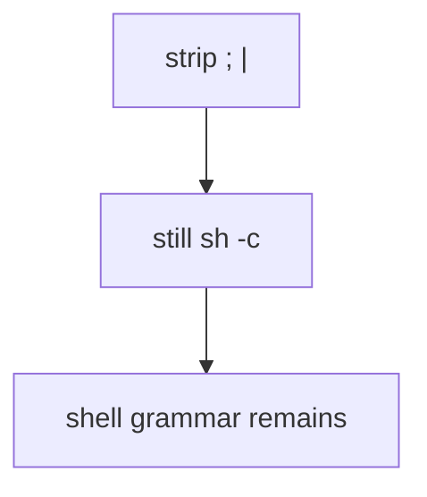

# 6.1-LO-02 — An argv map a second engineer can test

**Kind:** design-exercise
**Loop step:** 2 Model
**Standards:** OWASP ASVS 5.0.0 (final) `v5.0.0-1.2.5`.

## Can a second engineer name pytest cases from your interpreter map?

“We don’t use a shell” is not this lesson. A reviewable model names **which process is invoked, which argv slots are data, and which interpreters are out of this fixture**.

SecureCollab Phase 1 freeze: local `argv_for_list(name)` / `uses_shell`. No live `ls`.

## Mental model: argv slots, not a string

The program path is chosen by the application. The name occupies one slot. `--` tells the binary that later tokens are operands, not flags (argument-injection residual).

## Mental model: denylist is not mediation

Module 2.1 already showed encodings beating string filters. This map refuses a metacharacter denylist as the property.

## Step 1: freeze pieces

| Piece | This system |
|---|---|
| Subjects | member choosing an export name |
| Objects | argv list vs shell string |
| Actions | `argv_for_list`, `uses_shell` |
| Channels | OS process spawn (not executed in tests) |
| TCB | argv array, `uses_shell is False` |
| Untrusted | `name` |
| State / time | One list call |
| 1.1 cell | Integrity of the OS interpreter boundary |

## Step 2: write cells

| Subject | Object | Action | Decision |
|---|---|---|---|
| app | `ls` | spawn with argv | allow |
| attacker | name | as shell grammar | deny |
| plugin | `/bin/sh` | needed shell | isolate (residual) |
| export | CSV cells | formula chars | 1.2.10 advanced |

## Practice

Draw SQL vs shell vs template on one page. Point at `labs/6.1/6.1-lab` file `argv.py`.

## Transfer

Clinic CSV filename; Jinja includes.

## Residual risk

Argument injection; plugin shells; CSV formula (`v5.0.0-1.2.10` Level 3).

## Non-goals

Top 10 as the definition of security. Keys stay out of lessons.
