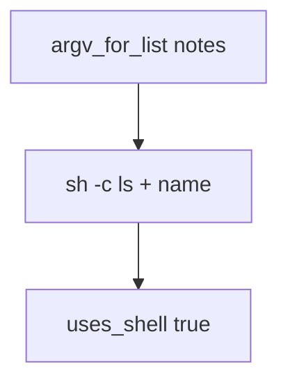

# 6.1-LO-03 — Observe argv shape, do not trophy a shell

**Kind:** mechanism-lab
**Loop step:** 3 Break
**Standards:** OWASP ASVS 5.0.0 (final) `v5.0.0-1.2.5`. `v5.0.0-1.2.10` (CSV/formula) is **Level 3, advanced**, not this pytest.

## Authorized scope

`labs/6.1/6.1-lab` only. The fixture is an in-process `argv_for_list` / `uses_shell`. Synthetic name `notes`. It does not spawn a process. Do not run a live OS command, an employer export worker, or a classmate preview as this exercise.

**Forbidden outcome:** user-controlled name executed via a shell string. `argv_for_list("notes")` starts with `["sh", "-c"]` and `uses_shell` is true.

Attacker capability in this lab: a member who can choose an export name. That stands in for a clinic CSV filename, a Jinja template name, or a mail header later. Trust assumption: `argv_for_list` is supposed to pass the name as **one argv element** to a fixed binary. A denylist of `;` `|` `$`, `shell=True` with “sanitized” strings, and “internal users are trusted” are not in the TCB for this cell.

## Mental model: sh -c is a second parser



The vulnerable tree demonstrates **cause** (name concatenated into a shell grammar), not a command-execution trophy. Preconditions: `argv_for_list` returns `['sh', '-c', 'ls ' + name]` and `uses_shell` is true. You do not need to execute the list. You must not.

ASVS `v5.0.0-1.2.5` wants OS calls that pass arguments as parameters. CWE-77/78 are awareness after the cause, not this oracle. Do not add metacharacter cookbooks to notes; honest name `notes` is enough.

## What to read in the fixture

`vulnerable/argv.py` concatenates the name into a `sh -c` string. Tests:

- `test_does_not_invoke_shell`
- `test_argv_is_program_then_name`

You do not need a new name string. The failure of `test_does_not_invoke_shell` *is* the evidence.

Do not open the fixed tree yet. Diagnose the cause first.

## Root cause vs impact vs prevention vs detection vs recovery

| Slice | This lab |
|---|---|
| Required property | Export name is an argv element, not shell grammar |
| Root cause | Concatenating untrusted data into a shell grammar |
| Preconditions | `argv_for_list` starts `sh -c`; `uses_shell` true |
| Trigger | `argv_for_list("notes")` |
| Impact | Integrity of the OS interpreter boundary (structure only here) |
| Prevention | Argv list to a fixed binary; `--` before the name; no shell |
| Detection | `child_process_anomaly` when program is `sh` |
| Recovery | Kill child; remove the concatenating path |
| Not the lesson | A CWE number, live command, or metacharacter cookbook |

## Framework defaults versus the interpreter guarantee

FastAPI has no opinion about argv. `subprocess.run(..., shell=True)` will parse the name. Next.js `child_process.exec` is a shell. The application guarantee is: **this** fixture, `cmd[:2] != ["sh", "-c"]` and `uses_shell` is false.

## Practice

```text
python3 -m pytest labs/6.1/6.1-lab/tests --impl vulnerable
```

Record `test_does_not_invoke_shell`. Do not probe public hosts. An environment error is not security evidence.

## Transfer

Clinic export filename. Predict without leaving this directory. Do not run a live export worker.

## Non-goals

No live-target instructions. Synthetic names only. Tests must not execute the argv.
