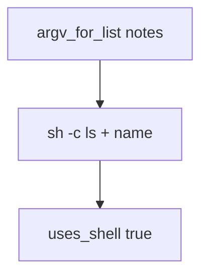

# Practice: a user-chosen name run through a shell string

**Kind:** mechanism-lab
**Loop step:** 3 Break

## Try it

The practice is not a website you attack. `argv_for_list` and `uses_shell` do not start a process. They glue the name into a shell string, so the name is already a command fragment.

> The export name is an argv element, not shell grammar. `argv_for_list` must not start `sh -c`.

## Where you may practice

Stay inside `labs/6.1/6.1-lab`. Fake name `notes` is the input to `argv_for_list` / `uses_shell`. It does not spawn a process.

Do not run a live OS command. Do not probe an employer export worker. Do not probe a classmate preview. Do not paste a live command “to see what happens.”

What must not happen: a user-chosen name run through a shell string. `argv_for_list("notes")` starts with `["sh", "-c"]` and `uses_shell` is true.

Who could do this: a member who can choose an export name. That stands in for a clinic CSV filename, a Jinja template name, or a mail header later. What is supposed to stop this: `argv_for_list` passes the name as **one argv element** to a fixed binary. A denylist of punctuation, `shell=True` with “cleaned” strings, and “internal users are trusted” are not enough.

## Picture: sh -c is a second parser



The broken files show **cause** (name concatenated into a shell string), not a live command. What has to be true first: `argv_for_list` returns `['sh', '-c', 'ls ' + name]` and `uses_shell` is true. You do not need to execute the list. You must not.

OS calls have to pass arguments as parameters. A scanner name for this family is a weakness label, not that check. The class of hostile names is text a shell would treat as extra grammar — extra commands, substitutions, or pipes. Treat it as data for one argv slot. Do not paste that class into notes as a cookbook. Honest name `notes` is enough, because the check looks at shape.

## What to look at: the cause, not a hunt

`vulnerable/argv.py` concatenates the name into a `sh -c` string. Tests:

- `test_does_not_invoke_shell`
- `test_argv_is_program_then_name`

You do not need a new name string.

| What you see | What kind of failure | Not the lesson |
|---|---|---|
| `argv_for_list` starts `sh -c` | Name glued into shell grammar | A scanner name |
| `uses_shell` is true | Shell still in the path | “subprocess will handle it” |
| Honest `notes` still glued in | Data treated as grammar | A live command |

## Why it happens, what it costs, how you stop it, how you notice, how you recover

| Slice | This practice |
|---|---|
| The rule | Export name is an argv element, not shell grammar |
| Why it happens | Concatenating untrusted data into a shell string |
| What has to be true first | `argv_for_list` starts `sh -c`; `uses_shell` true |
| Trigger | `argv_for_list("notes")` |
| What it costs | Integrity of the OS interpreter boundary (structure only here) |
| How you stop it | Argv list to a fixed binary; `--` before the name; no shell |
| How you notice | `child_process_anomaly` when the program is `sh` |
| How you recover | Kill the child; remove the concatenating path |
| Not the lesson | A scanner name, a live command, or a punctuation cookbook |

## What the framework does vs what you still have to check

FastAPI has no opinion about argv. `subprocess.run(..., shell=True)` will parse the name. Next.js `child_process.exec` is a shell. `cmd[:2] != ["sh", "-c"]` and `uses_shell` is false.

## Practice

```text
python3 -m pytest labs/6.1/6.1-lab/tests --impl vulnerable
```

Do not probe public hosts. A setup error is not proof the rule holds.

## Use it somewhere new

Clinic export filename. Predict without leaving this directory. Do not hit a live export worker.

## What this page is not doing

No live-target instructions. Fake names only. No weaponized shell strings. Tests must not execute the argv. Do not “fix” the practice by deleting the test.
