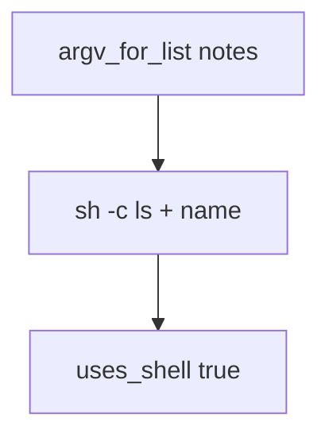

# 6.1-LO-03 — Observe argv shape, do not trophy a shell

**Kind:** mechanism-lab
**Loop step:** 3 Break
**Standards:** OWASP ASVS 5.0.0 (final) `v5.0.0-1.2.5`.

## Authorized scope

`labs/6.1/6.1-lab` only. Synthetic name `notes`. No live OS commands.

**Forbidden outcome:** User-controlled name executed via a shell string.

## Mental model: sh -c is a second parser



The vulnerable tree demonstrates **cause** (name concatenated into a shell grammar), not a command-execution trophy.

## What to read in the fixture

`vulnerable/argv.py` returns `['sh', '-c', 'ls ' + name]` and `uses_shell` true. Tests require that the first two argv elements are not `sh -c` and that `uses_shell` is false. Honest name `notes` is enough. Do not add metacharacter cookbooks to notes.

## Root cause vs impact

| Slice | Lab |
|---|---|
| Root cause | Concatenating untrusted data into a shell grammar |
| Impact | OS interpreter would run attacker grammar (structure only here) |
| Not the lesson | A CWE number as the definition |

## Practice

```
python3 -m pytest labs/6.1/6.1-lab/tests --impl vulnerable
```

Record `test_does_not_invoke_shell`. Do not probe public hosts.

## Transfer

Clinic export filename. Predict without leaving this directory.

## Non-goals

No live-target instructions. Synthetic data only.
