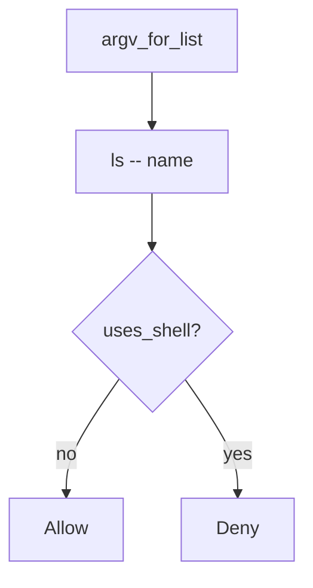

# Pass the name as an argv element

**Kind:** design-exercise
**Loop step:** 4 Build

## The rule

A denylist of punctuation does not change argv. “subprocess will handle it” can still be `sh -c`. Commenting “internal users are trusted” is not `argv_for_list`.

Put simply, the shell never sees the name. `argv_for_list` must return a list whose program is `ls` (or another fixed binary), not `sh`. The name is one element. `--` before the name is the extra slot that closes argument injection as a *named* leftover.

The check in export listing: list, not string. If you cannot spawn without a shell, **do not spawn**. A name that “looks like notes” is not an argv list.

## Picture: list, not string



`argv_for_list` returns `["ls", "--", name]`. `subprocess.run` still has to get that list with `shell=False`. A denylist of punctuation fails the 2.1 encoding lesson. Path traversal of the name is 6.4, a different check. Formula characters in the file *contents* are advanced leftover, not argv.

Pass arguments as parameters — `argv_for_list`.

## What the repaired files must show

Do not treat `fixed/argv.py` as a production process launcher.

| After the fix | Must be true |
|---|---|
| honest `notes` | argv starts with `ls`, not `sh -c` |
| `uses_shell` | false |
| name slot | last element is the name, not `ls notes` as one string |

By default, if you cannot spawn without a shell, the answer is no spawn. A well-formed name is not a list.

## What this is not

A denylist of punctuation. `shell=True` with “cleaned” strings. Commenting “internal users are trusted.” A scanner finding as the title. Executing the argv to “prove” it.

## What the tool cannot do

- Argument injection if `--` is omitted (a name that starts with `-` can become a flag).
- Plugin shells and `child_process.exec` are other paths of the same check.
- Path traversal of the name is 6.4.
- Formula characters in CSV *content* are file body, not argv.
- SQL (5.5) is the same *shape* at a different interpreter.

## Practice

Name the check (program ≠ `sh` ∧ last element is the name ∧ not `uses_shell`). Run:

```text
python3 -m pytest labs/6.1/6.1-lab/tests --impl fixed
```

Do not execute the returned list.

## Use it somewhere new

Stop wrapping the export filename in `sh -c`; pass it as argv.

## What can still go wrong

Argument injection; plugin shells; CSV formula leftover; 6.4 path cells.

## What this page is not doing

Do not spawn a live process. A denylist does not mark you finished.

