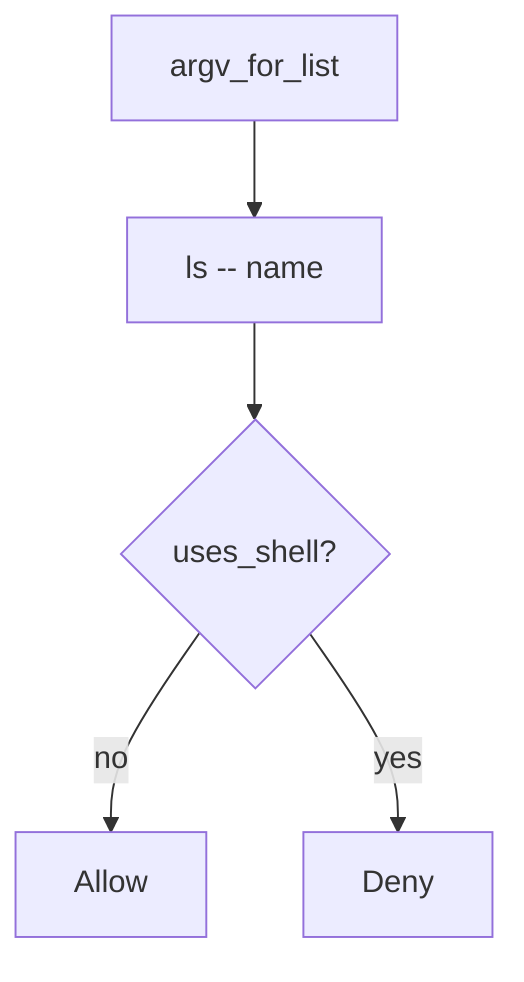

# 6.1-LO-04 — Pass the name as an argv element

**Kind:** design-exercise
**Loop step:** 4 Build
**Standards:** OWASP ASVS 5.0.0 (final) `v5.0.0-1.2.5`. `v5.0.0-1.2.10` is **Level 3, advanced**.

## Structural means the shell never sees the name

`argv_for_list` must return a list whose program is `ls` (or another fixed binary), not `sh`. The name is one element. `--` before the name is the extra slot that closes argument injection as a *named* residual.

The smallest restore for SecureCollab Phase 1 export listing is: list, not string. Fail-safe: if you cannot spawn without a shell, **do not spawn**. Do not fail open because the name “looks like notes.”

## Mental model: list, not string



The lab’s fixed tree is `["ls", "--", name]`. Production still has to call `subprocess.run` with that list and `shell=False`. A denylist of metacharacters fails the 2.1 encoding lesson. Path traversal of the name is 6.4, a different cell. CSV formula characters in the file *contents* are `v5.0.0-1.2.10` Level 3 advanced.

ASVS `v5.0.0-1.2.5` wants arguments as parameters. This pytest is that sentence for `argv_for_list`.

## Why this restores the cell

| After the fix | Must be true |
|---|---|
| honest `notes` | argv starts with `ls`, not `sh -c` |
| `uses_shell` | false |
| name slot | last element is the name, not `ls notes` as one string |

## What this is not

A denylist of `;` `|` `$`. `shell=True` with “sanitized” strings. Commenting “internal users are trusted.” CWE-78 as the finding title. Executing the argv to “prove” it.

## Mechanism limits

- Argument injection if `--` is omitted (name starts with `-` can become a flag).
- Plugin shells and `child_process.exec` are other paths of the same cell.
- Path traversal of the name is 6.4.
- CSV/formula injection (`v5.0.0-1.2.10` Level 3 advanced) is file *content*, not argv.
- SQL (5.5) is the same *shape* at a different interpreter.

## Practice

Name the predicate (program ≠ `sh` ∧ last element is the name ∧ not `uses_shell`). Run:

```text
python3 -m pytest labs/6.1/6.1-lab/tests --impl fixed
```

Must pass. Do not execute the returned list.

## Transfer

Clinic: stop wrapping the export filename in `sh -c`; pass it as argv.

## Residual risk

Argument injection; plugin shells; CSV formula Level 3; 6.4 path cells.

## Non-goals

Do not spawn a live process. Do not claim Gate 6 from a denylist.
