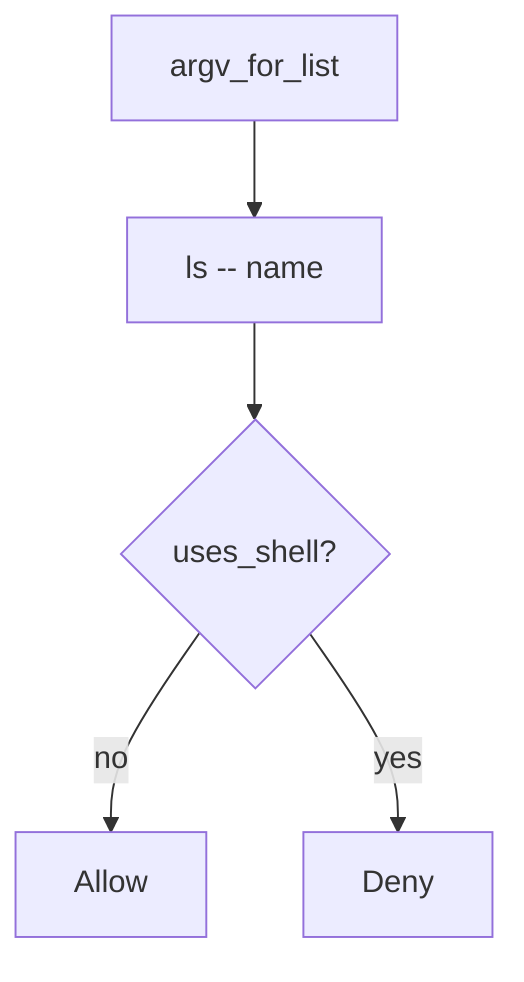

# Pass the name as an argv element

**Kind:** design-exercise
**Loop step:** 4 Build

## The rule

A denylist of punctuation is not the fix. “subprocess will handle it” is not the fix. Commenting “internal users are trusted” is not the fix.

Structural means the shell never sees the name. `argv_for_list` must return a list whose program is `ls` (or another fixed binary), not `sh`. The name is one element. `--` before the name is the extra slot that closes argument injection as a *named* leftover.

The smallest restore for notes-app export listing is: list, not string. Fail closed: if you cannot spawn without a shell, **do not spawn**. Do not fail open because the name “looks like notes.”

## Picture: list, not string



The lab’s repaired files return `["ls", "--", name]`. Production still has to call `subprocess.run` with that list and `shell=False`. A denylist of punctuation fails the 2.1 encoding lesson. Path traversal of the name is 6.4, a different check. Formula characters in the file *contents* are advanced leftover, not argv.

Pass arguments as parameters. This week's check is about `argv_for_list`.

## What the repaired files must show

Open `fixed/argv.py`. Do not treat the snippet as a production process launcher.

| After the fix | Must be true |
|---|---|
| honest `notes` | argv starts with `ls`, not `sh -c` |
| `uses_shell` | false |
| name slot | last element is the name, not `ls notes` as one string |

Fail closed: if you cannot spawn without a shell, the answer is no spawn. Uncertainty is a **deny**, not a yes because the name looked well-formed.

## What this is not

A denylist of punctuation. `shell=True` with “cleaned” strings. Commenting “internal users are trusted.” A scanner finding as the title. Executing the argv to “prove” it.

## What the tool cannot do

- Argument injection if `--` is omitted (a name that starts with `-` can become a flag).
- Plugin shells and `child_process.exec` are other paths of the same check.
- Path traversal of the name is 6.4.
- Formula characters in CSV *content* are file body, not argv.
- SQL (5.5) is the same *shape* at a different interpreter.

## Practice

Name the check (program ≠ `sh` ∧ last element is the name ∧ not `uses_shell`). Run:

```text
python3 -m pytest labs/6.1/6.1-lab/tests --impl fixed
```

Do not execute the returned list.

## Use it somewhere new

A clinic example: stop wrapping the export filename in `sh -c`; pass it as argv.

## What can still go wrong

Argument injection; plugin shells; CSV formula leftover; 6.4 path cells.

## What this page is not doing

Do not spawn a live process. Do not claim a course gate from a denylist.

