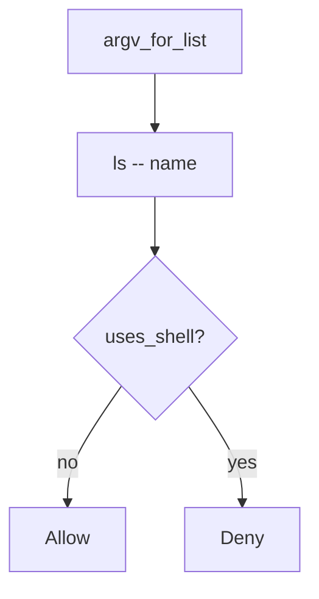

# 6.1-LO-04 — Pass the name as an argv element

**Kind:** design-exercise
**Loop step:** 4 Build
**Standards:** OWASP ASVS 5.0.0 (final) `v5.0.0-1.2.5`.

## Structural means the shell never sees the name

`argv_for_list` must return a list whose program is `ls` (or another fixed binary), not `sh`. The name is one element. `--` before the name is the extra slot that closes argument injection as a *named* residual.

## Mental model: list, not string



Fail-safe: if you cannot spawn without a shell, **do not spawn**.

## Why this restores the cell

| After the fix | Must be true |
|---|---|
| honest `notes` | argv starts with `ls`, not `sh -c` |
| `uses_shell` | false |
| name slot | last element is the name, not `ls notes` as one string |

## What this is not

A denylist of `;` `|` `$`. `shell=True` with “sanitized” strings. Commenting “internal users are trusted.”

## Practice

Name the predicate. Run:

```
python3 -m pytest labs/6.1/6.1-lab/tests --impl fixed
```

Must pass.

## Transfer

Clinic: stop wrapping the export filename in `sh -c`.

## Residual risk

Argument injection if `--` is omitted; plugin shells; CSV formula Level 3 (`v5.0.0-1.2.10`).
