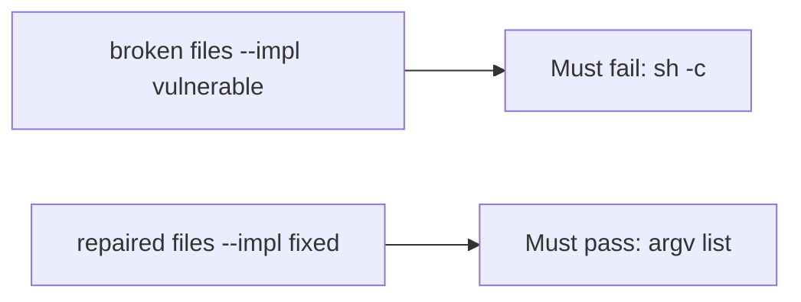

# A shell command from user text must fail the check

**Kind:** verification-lab
**Loop step:** 5 Verify

## Check it

A comment that says you don’t use a shell does not change argv. A sanitized filename is a string munge. `argv_for_list("notes")[:2]` must not be `["sh", "-c"]`, and `uses_shell("notes")` has to be False. On the broken files it still returns `sh -c`. On the repaired files it does not. Tests **must not** execute the argv.

## Picture: sh -c must fail the check

A passing-test tally can still hide that the name is still glued into a shell string.



If both pass, you are not looking at `sh -c`.

## What the check has to show

| Mode | Must show for this topic |
|---|---|
| Normal | Honest name `notes` is an argv element (`test_argv_is_program_then_name`) |
| Wrong input / abuse | `sh -c` concat is forbidden; broken files must fail |
| Failure | If you cannot spawn without a shell, do not spawn |
| Not claimed | live `ls`; argument-injection strings; CSV formula |

The test `test_does_not_invoke_shell` is there so a shell string still fails. Do not add a name from the hostile class — extra commands, substitutions, or pipes a shell would parse — to “make the test more real.” Honest `notes` is enough.

A `shell=False` comment is not `argv_for_list`. This practice never starts a live process.

```text
python3 -m pytest labs/6.1/6.1-lab/tests --impl vulnerable
python3 -m pytest labs/6.1/6.1-lab/tests --impl fixed
```

Honest argv shape must pass on repaired. `sh -c` must fail on broken. If the broken files do not fail the `cmd[:2] != ["sh", "-c"]` branch, the lab is miswired — fix the wiring, not the assertion. A setup error is not proof the rule holds.

## What the tests do not prove

- Path traversal (6.4)
- SQL (5.5) except as the same *shape*
- CSV/formula leftover
- That `subprocess.run` in production uses this list (you still have to call it)
- Argument injection when `--` is omitted

## Practice

Call `argv_for_list`. A `shell=False` comment is a hope, not argv.

## Use it somewhere new

An export file on disk is the bytes, not list-form argv (see 9.3). Do not run a test that executes argv.

## What this page is not doing

Do not execute the argv. Do not log export names that are patient identifiers. Answer keys are not on this site.
