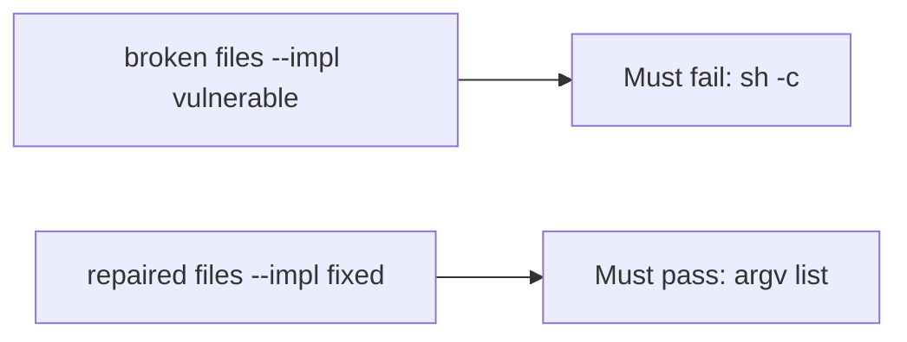

# Fail on the broken files, then pass on the repaired ones

**Kind:** verification-lab
**Loop step:** 5 Verify

## If you cannot test it, it is still a slogan

“We don’t use a shell” is not evidence. “Filename is sanitized” is a tool observation. The check is: `argv_for_list("notes")[:2] != ["sh", "-c"]` and `uses_shell("notes") is False`. That observation must be **false** on the broken files (returns `sh -c`) and **true** on the repaired files. Tests **must not** execute the argv.

## Picture: sh -c must fail the check

A test that only counts passing cases can pass while the name is still glued into a shell string. This check asks whether `sh -c` still counts as a passing control. Broken must fail that question. Repaired must pass it.



If both pass, the test is not looking at `sh -c`. If both fail, the fix is not structural or the check is wrong.

## Four modes, even for one list call

| Mode | Must show for this topic |
|---|---|
| Normal | Honest name `notes` is an argv element (`test_argv_is_program_then_name`) |
| Wrong input / abuse | `sh -c` concat is forbidden; broken files must fail |
| Failure | If you cannot spawn without a shell, do not spawn |
| Not claimed | live `ls`; argument-injection strings; CSV formula |

The file is `labs/6.1/6.1-lab/tests/test_property.py`. The test `test_does_not_invoke_shell` is a **what-must-not-happen** test: a shell string is not allowed to count as a passing control. Do not add a name from the hostile class — extra commands, substitutions, or pipes a shell would parse — to “make the test more real.” Honest `notes` is enough.

A test that only asserts HTTP 200 is not this topic's evidence. A test that only greps `shell=False` in a comment without calling `argv_for_list` is not this topic's evidence. This practice never starts a live process.

```text
python3 -m pytest labs/6.1/6.1-lab/tests --impl vulnerable
python3 -m pytest labs/6.1/6.1-lab/tests --impl fixed
```

Honest argv shape must pass on repaired. `sh -c` must fail on broken. If the broken files do not fail the `cmd[:2] != ["sh", "-c"]` branch, the lab is miswired — fix the wiring, not the assertion. An environment error is not security evidence.

## What the tests do not prove

- Path traversal (6.4)
- SQL (5.5) except as the same *shape*
- CSV/formula leftover
- That `subprocess.run` in production uses this list (you still have to call it)
- Argument injection when `--` is omitted

Record those as leftover or later topics, not as silent passes.

## Practice

Run both this session:

```text
python3 -m pytest labs/6.1/6.1-lab/tests --impl vulnerable
python3 -m pytest labs/6.1/6.1-lab/tests --impl fixed
```

Paste nothing from answer keys. Write fail/pass into your notes next to the matrix row. Reject a “test” that only greps `shell=False` in a comment without calling `argv_for_list`.

## Use it somewhere new

Clinic CSV filename. A test that only asserts the export file exists is not this check (see 9.3). A test that executes argv is out of scope.

## What this page is not doing

Do not execute the argv. Do not log export names that are patient identifiers. Answer keys stay out of this file.
