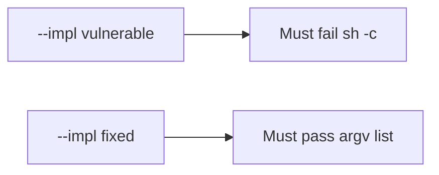

# 6.1-LO-05 — Evidence is argv shape, then a passing pair

**Kind:** verification-lab
**Loop step:** 5 Verify
**Standards:** OWASP ASVS 5.0.0 (final) `v5.0.0-1.2.5`.

## An invariant that cannot fail a test is still a slogan

“We don’t use a shell” is not evidence. The oracle is the local pair. Tests **must not** execute the argv.

## Mental model: vulnerable must fail: sh -c

The failing observation on `--impl vulnerable` is **sh -c**. A passing collection count is not this cell.



| Case | Must show |
|---|---|
| Negative / abuse | `sh -c` concat is forbidden |
| Normal | honest name `notes` is an argv element |
| Not claimed | live `ls`; argument injection payloads; CSV formula |

```
python3 -m pytest labs/6.1/6.1-lab/tests --impl vulnerable
python3 -m pytest labs/6.1/6.1-lab/tests --impl fixed
```

## What the tests do not prove

- Path traversal (6.4)
- SQL (5.5) except as the same *shape*
- `v5.0.0-1.2.10` CSV/formula Level 3
- That `subprocess.run` in production uses this list (you still have to call it)

## Practice

Execute both implementations. Map each test to an LO-02 cell.

## Transfer

Clinic CSV filename. A test that only asserts the export file exists is not this cell.
