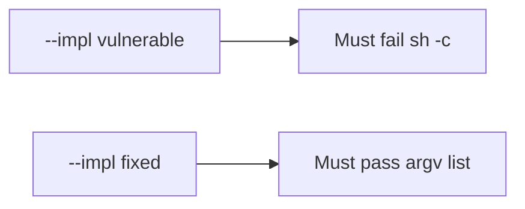

# 6.1-LO-05 — Evidence is argv shape, then a passing pair

**Kind:** verification-lab
**Loop step:** 5 Verify
**Standards:** OWASP ASVS 5.0.0 (final) `v5.0.0-1.2.5`.

## An invariant that cannot fail a test is still a slogan

“We don’t use a shell” is not evidence. “Filename is sanitized” is a mechanism observation. The oracle is: `argv_for_list("notes")[:2] != ["sh", "-c"]` and `uses_shell("notes") is False`. That observation must be **false** on `--impl vulnerable` (returns `sh -c`) and **true** on `--impl fixed`. Tests **must not** execute the argv.

## Mental model: vulnerable must fail: sh -c

The failing observation on `--impl vulnerable` is **sh -c**. A passing collection count is not this cell.



| Mode | Must show for this module |
|---|---|
| Normal | honest name `notes` is an argv element (`test_argv_is_program_then_name`) |
| Negative / abuse | `sh -c` concat is forbidden; vulnerable must fail |
| Not claimed | live `ls`; argument injection payloads; CSV formula |

Lab tests in `labs/6.1/6.1-lab/tests/test_property.py`. `test_does_not_invoke_shell` is a **forbidden-outcome** test: a shell string is not allowed to count as a passing control.

```text
python3 -m pytest labs/6.1/6.1-lab/tests --impl vulnerable
python3 -m pytest labs/6.1/6.1-lab/tests --impl fixed
```

If vulnerable does not fail `cmd[:2] != ["sh", "-c"]`, the lab is miswired—fix the wiring, not the assertion. Do not add a name that is a metacharacter cookbook to “make the test more real.”

## What the tests do not prove

- Path traversal (6.4)
- SQL (5.5) except as the same *shape*
- `v5.0.0-1.2.10` CSV/formula Level 3
- That `subprocess.run` in production uses this list (you still have to call it)
- Argument injection when `--` is omitted

Record those as residuals or later modules, not as silent passes.

## Practice

Execute both implementations this session. Write the fail/pass pair next to the matrix row. Reject a “test” that only greps `shell=False` in a comment without calling `argv_for_list`.

## Transfer

Clinic CSV filename. A test that only asserts the export file exists is not this cell (see 9.3). A test that executes argv is out of scope.

## Non-goals

Do not execute the argv. Do not log export names that are patient identifiers. Keys stay out of this file.
