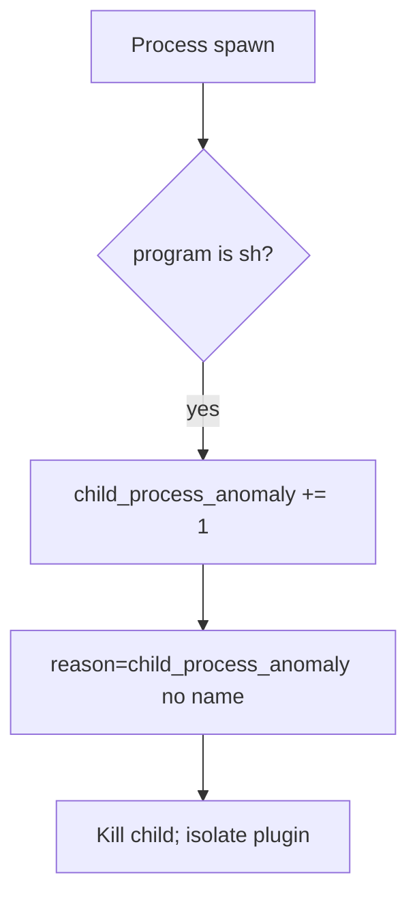

# Notice a child-process anomaly

**Kind:** operations-exercise
**Loop step:** 6 Operate

## Fixing it once is not enough

A plugin path can glue `sh -c` after `argv_for_list` returns a list. Page the shell spawn, stop the process, and restore the list form.

Patient export names and filenames do not go in the ticket.

## Picture: unexpected child is a signal

If a child program is `sh` after an export-helper change, keep filenames out of the pager. Then kill the child and remove the concatenating path.



A process-monitor product does not turn `sh -c` into argv.

## Signals that do not become a second leak

| Outcome | This topic |
|---|---|
| Notice | `child_process_anomaly` |
| What the line holds | request id, program basename — **never** the full argv if it holds patient data |
| Respond | Kill the child; isolate a needed-shell plugin |
| Recover | Remove the concatenating path; re-run `test_does_not_invoke_shell` |
| Leftover | Argument injection; host compromise if it left the lab (must not) |

```text
log_denied reason=child_process_anomaly program=sh request_id=req_61a
```

The argv is sitting in the sample if it still holds a note body, a real email, a patient filename, or a shell-punctuation cookbook.

Paste the full argv with a patient filename into the alert and the pager now holds a second copy of the 3.1 / 5.1 leak.

A CI grep that finds no `sh` does not prove argv is a list. Plugin loaders still glue into `sh -c` if you only fixed `argv_for_list`.

## What the framework does vs what you still have to check

A host product will page on `sh` children and stay silent when the Python helper still returns `["sh", "-c", …]` in a test that nobody runs. Detection must observe **program basename `sh` at spawn**, not a scanner nickname. If the alert includes the full argv with a patient filename, you have opened a leftover hole from topics 3.1 and 5.1.

## Practice

A deny line can hold ids, a reason, and the program basename — not the export name. A note body, a real email, a patient filename, or a shell cookbook would dump the argv onto the child-process line.

## Use it somewhere new

Notice unexpected `sh` under the export worker; do not paste filenames into the ticket if they are patient ids. Do not hunt a live worker.

## What this page is not doing

Do not use live command execution. This site does not mark you as finished. Answer keys are not on this site.
